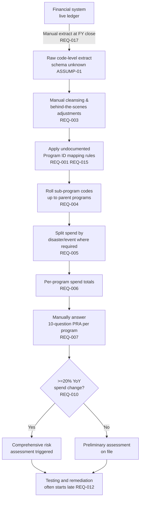
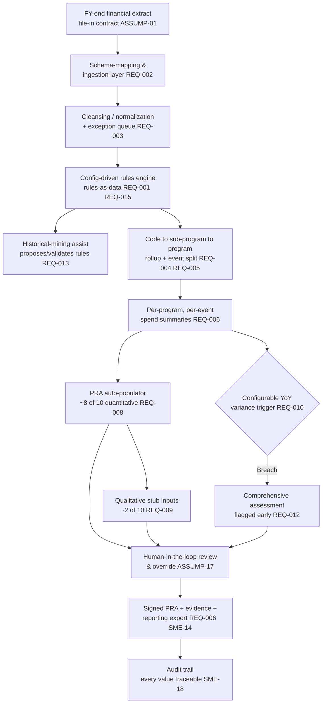
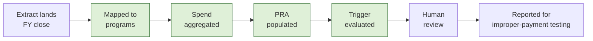

# 05 — Business Architecture

**Package:** FEMA Program ID & Preliminary Risk Assessment (PRA) Automation (demo)
**Document date:** 2026-07-08
**Status:** Conceptual demo design — not production. Every internal FEMA figure, form, or rule referenced here is either a verified public source (`SRC-`) or an explicitly labeled synthetic stand-in (`ASSUMP-`).
**Cross-references:** requirements `REQ-` (file 02), assumptions `ASSUMP-` (file 03), sources `SRC-` (file 04), SME questions `SME-` (file 13).

---

## 1. Business context and driver

FEMA is required to report designated programs for **improper-payment testing** under the Payment Integrity Information Act of 2019 (PIIA) and OMB Circular A-123 Appendix C / M-21-19 (`SRC-06`, `SRC-07`; oversight evidence `SRC-09`, `SRC-10`). The improper-payment regime requires a periodic **risk assessment** per program; programs found susceptible carry additional estimation and reporting duties. The client's "10-question preliminary risk assessment" (PRA) is the front end of that regime (`REQ-018`, `ASSUMP-14`).

Today, producing the inputs to that assessment is slow and manual:

- The **spend figure** that drives each program's assessment comes from a financial-system extract that must be hand-cleansed and mapped to a Program ID via **undocumented rules** the team does not hold (`REQ-001`, `REQ-003`, `REQ-015`).
- The final actual-spend data lands **weeks or months after fiscal-year close**, delaying the whole assessment cycle and pushing any remediation late into (or past) the year in which it would matter (`REQ-012`, `REQ-017`).

The business ambition (attributed in the transcript to the primary stakeholder's office, "talked about for years") is to **take the financial data and automatically populate the PRA**, flag the programs that cross the comprehensive-assessment trigger, and do it early enough to act (`REQ-007`, `REQ-010`, `REQ-012`).

> **Framing note:** Use "assessment lifecycle" / "risk-assessment cycle," never "appeal lifecycle" — the latter is a transcription artifact (`ASSUMP-14`). No appeals workflow is in scope.

---

## 2. Current-state process (as-is)

The as-is is reconstructed from the transcript and is therefore partly inferred; unknowns are logged as assumptions, not asserted as fact.

**Key characteristics of the as-is:**

| Trait | Detail | Evidence |
|---|---|---|
| Snapshot cadence | Data pulled once at FY-end, not continuously | `REQ-017`, `ASSUMP-13` |
| Opaque mapping | Program ID rules exist "somewhere" but are inaccessible; team only sees outputs | `REQ-001`, `REQ-015` |
| Manual reconciliation | Source-to-program is not one-for-one; hand adjustments happen "behind the scenes" | `REQ-003` |
| Many-to-one rollups | Sub-programs A/B/C (distinct codes) roll to one reporting program | `REQ-004` |
| Event splits | Some programs report separately by disaster (Harvey/Irma/Maria) | `REQ-005`, `ASSUMP-08` |
| Late signal | Final spend arrives weeks/months post-close; remediation slips | `REQ-012` |
| Possible legacy form | Recollection of a "macro-based" tool | `REQ-021`, `ASSUMP-15` |

---

## 3. Future-state process (to-be, demo concept)

The to-be keeps the **same business logic** the client uses today but makes it **explicit, configurable, faster, and auditable**. Nothing here claims the demo integrates with the live system — it processes a synthetic FY-end batch (`ASSUMP-13`).

---

## 4. Pain points → future-state relief

| # | Current pain | Root cause | Future-state relief | Traces to |
|---|---|---|---|---|
| P1 | Program ID mapping is opaque and unrepeatable | Rules undocumented / inaccessible | Rules externalized as editable config; historical mining proposes them with confidence | `REQ-001`, `REQ-013`, `REQ-015` |
| P2 | Manual cleansing is slow and error-prone | Source-to-program not 1:1 | Automated normalization + exception queue mirrors today's adjustments | `REQ-003` |
| P3 | Rollups & event splits done by hand | No shared hierarchy model | Hierarchical dimension model (code→sub-program→program; event axis) | `REQ-004`, `REQ-005` |
| P4 | PRA filled in manually per program | No binding from data to questions | Auto-populate ~8/10 quantitative questions; stub the ~2 qualitative | `REQ-007`, `REQ-008`, `REQ-009` |
| P5 | Comprehensive-assessment programs found late | Spend lands post-close; manual math | Configurable YoY trigger runs the instant data lands | `REQ-010`, `REQ-012` |
| P6 | Remediation starts too late to matter | End-to-end latency | Earlier identification compresses time-to-decision | `REQ-012` |
| P7 | No defensible audit story | Manual, undocumented steps | Every output value carries evidence + lineage | `SME-18` (new) |

---

## 5. Business capabilities

Capability map for the target concept (demo implements the shaded core; outer ring is roadmap).

| Capability | Demo? | Primary requirement |
|---|---|---|
| C1 Ingestion | Yes | `REQ-002` |
| C2 Cleansing/normalization | Yes | `REQ-003` |
| C3 Program ID mapping (config) | Yes | `REQ-001`, `REQ-015` |
| C4 Rollup | Yes | `REQ-004` |
| C5 Event split | Yes | `REQ-005` |
| C6 Aggregation + variance | Yes | `REQ-006`, `REQ-010` |
| C7 PRA auto-population | Yes | `REQ-007`, `REQ-008`, `REQ-009` |
| C8 Trigger | Yes | `REQ-010` |
| C9 Human review/override | Yes | `ASSUMP-17` (new) |
| C10 Reporting/export | Yes | `REQ-006`, `SME-14` (new) |
| R1 Continuous feed | Roadmap | `REQ-022` |
| R2 Live integration | Roadmap | `REQ-023` |
| R3 SOP-validated rules | Roadmap | `REQ-015` |
| R4 Production security/ATO | Roadmap | `SME-09` |

---

## 6. Users and stakeholders

Named individuals from the transcript are retained **only as roles to confirm** — speaker labels in the export are unreliable (`SME-16`, new).

| Stakeholder / role | Interest in the solution | Demo touchpoint |
|---|---|---|
| Program stakeholder (Mike Walker's office) | Sponsor; wants the automation vision realized | Executive dashboard; talk track (file 14) |
| Laura Pollard, Greg Teets (acting DCFO) (FEMA stakeholders) | Demo audience; evaluate concept fidelity | Walkthrough (file 11) |
| Finance-center contact | Owns the extract and adjustment know-how | Ingestion + mapping screens; `SME-03`, `SME-04` |
| Program office analyst (future user) | Would run assessments, supply qualitative answers | Review/override + qualitative stub |
| Reviewer / approver (future user) | Signs off finalized PRA | Human-in-the-loop screen (`ASSUMP-17`) |
| Client tech contact (Brett) | Confirms cloud/tooling constraints | Architecture options (files 06/07); `SME-09` |
| Client POC (SOP) | May hold the Program ID SOP | Rules-as-data narrative; `SME-02` |
| Delivery team lead | Owns synthetic-data method & assumptions | Assumptions/validation screen |

---

## 7. Value stream (idea → assessed program)

The shaded steps are where automation removes the weeks-to-months latency (`REQ-012`). The value is **time-to-decision**, not headcount reduction — earlier identification enables in-year remediation.

---

## 8. Business rules (demo-modeled)

All rules are **configuration, not code** (`REQ-015`, `ASSUMP-12`) so they can be replaced when the real SOP arrives.

| Rule ID | Business rule | Configurable parameters | Source / caveat |
|---|---|---|---|
| BR-1 | A financial code maps to exactly one sub-program in a given FY | code→sub-program table | Inferred; `ASSUMP-02`, confirm `SME-04` |
| BR-2 | Sub-programs roll up to exactly one parent reporting program | sub-program→program table | `REQ-004`; confirm `SME-04` |
| BR-3 | Where required, program spend is split by disaster/event | event-segment extraction rule | `REQ-005`, `ASSUMP-08`; confirm `SME-06` |
| BR-4 | Records the rules cannot classify go to an exception queue | confidence threshold (`ASSUMP-16`, new) | Mirrors manual adjustments `REQ-003` |
| BR-5 | A program with ≥ threshold YoY spend change triggers comprehensive assessment | threshold (default 20%), direction (default either), measure (disbursements) | `REQ-010`, `ASSUMP-03`; confirm `SME-01` |
| BR-6 | ~8/10 PRA questions auto-populate from spend/funding; ~2 require program-office input | per-question binding + auto/manual flag | `REQ-008`, `REQ-009`; confirm `SME-05` |
| BR-7 | No PRA is finalized without human review/sign-off | reviewer role, sign-off step | `ASSUMP-17` (new); confirm `SME-16` |

---

## 9. Success metrics

| Metric | As-is baseline (to confirm) | Target concept | Confirms via |
|---|---|---|---|
| Time from FY-close data to populated PRA | Weeks–months | Same-day (batch run) | `SME-08` |
| PRA questions auto-populated | 0 (manual) | ~8 of 10 (~80%) | `REQ-008`, `SME-05` |
| Comprehensive-assessment programs identified before manual cutoff | Late/variable | All, at data-land time | `REQ-010`, `SME-08` |
| Mapping decisions with recorded evidence/confidence | None (opaque) | 100% traceable | `REQ-013`, `SME-15` (new) |
| Records auto-classified vs. sent to exception queue | Unknown | Reported per run | `REQ-003`, `ASSUMP-16` |

> Baselines are marked *to confirm* — quantifying the as-is is `SME-08`. The demo shows the *shape* of improvement, not audited numbers.

---

## 10. Operational benefits

- **Earlier remediation window** — programs crossing the trigger surface at data-land time, not months later (`REQ-012`).
- **Repeatable, defensible mapping** — opaque tribal knowledge becomes editable, versioned configuration with confidence scores (`REQ-001`, `REQ-013`).
- **Auditability** — every PRA value traces to a source record, a rule, and (where applicable) a human decision (`SME-15`, `SME-18`, new).
- **Portability** — file-in/file-out, source-agnostic design survives the pending financial-system migration (`REQ-019`, `ASSUMP-12`).
- **Lower key-person risk** — the "behind-the-scenes adjustments" become documented exception rules rather than one analyst's memory (`REQ-003`).

---

### New IDs coined in this file

| New ID | Meaning | Consolidated in |
|---|---|---|
| `ASSUMP-16` | Records below a confidence threshold route to an exception queue rather than auto-classifying | files 09, 16 |
| `ASSUMP-17` | No PRA is finalized without human review/sign-off (mandatory human-in-the-loop) | files 09, 16 |
| `SME-14` | Exact reporting-output formats/fields required (Excel/PDF/dashboard/API) — resolves REQ-006 "etc." | file 13 |
| `SME-15` | Explainability/evidence + confidence-threshold standards for auditor acceptance | file 13 |
| `SME-16` | Actual users, roles, RBAC, and PRA sign-off authority | file 13 |
| `SME-18` | Audit-trail, record-retention, and immutability requirements | file 13 |
