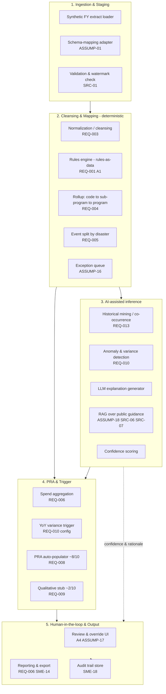
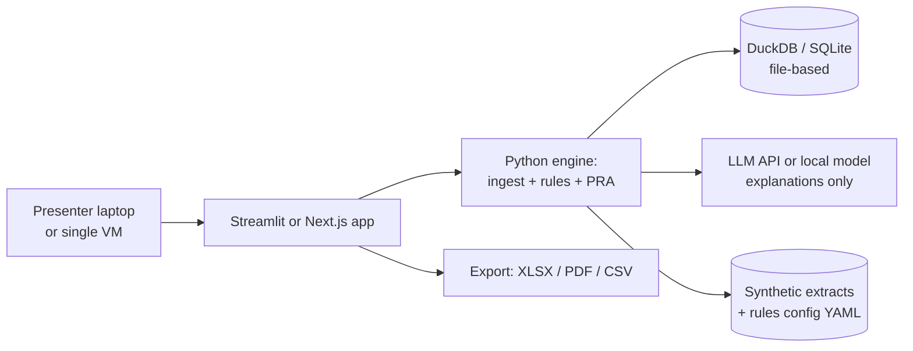
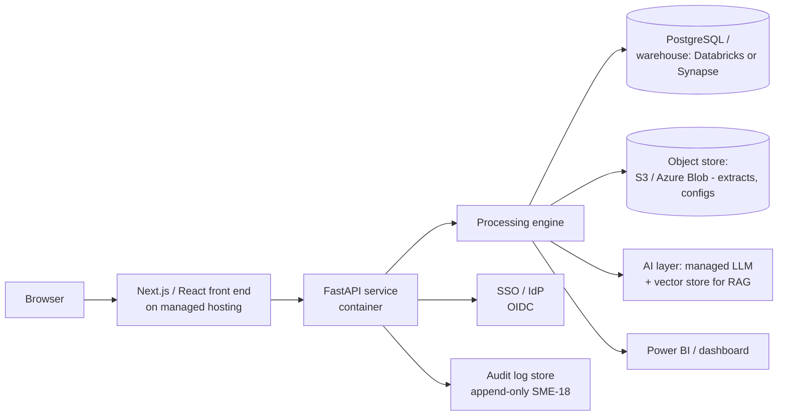
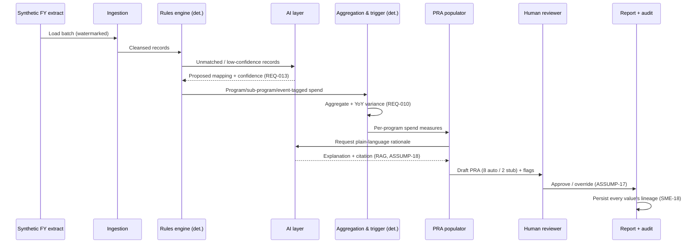
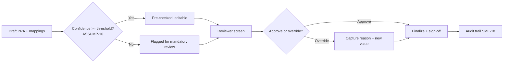

# 06 — Solution Architecture

**Package:** FEMA Program ID & PRA Automation (demo)
**Document date:** 2026-07-08
**Status:** Conceptual demo. No production readiness implied; FedRAMP/ATO are routed to file 15 and roadmap Wave 8 (`SME-09`).
**Cross-references:** `REQ-` (02), `ASSUMP-` (03), `SRC-` (04), `SME-` (13). Tech choices are detailed in file 07; this file is platform-neutral where possible.

---

## 1. Architectural principles

| # | Principle | Why | Traces to |
|---|---|---|---|
| A1 | **Rules-as-data** — mapping and trigger logic are editable configuration, never hard-coded | Real rules are undocumented and must be swappable when the SOP arrives | `REQ-001`, `REQ-015`, `ASSUMP-06` |
| A2 | **File-in / file-out, source-agnostic** | Must survive the pending financial-system migration | `REQ-019`, `ASSUMP-12` |
| A3 | **Deterministic core, AI on the edges** | Auditable math must not depend on a model's discretion (see file 09) | `REQ-010`, `SME-15` |
| A4 | **Human-in-the-loop before finalize** | Improper-payment outputs are consequential; no silent auto-sign-off | `ASSUMP-17` |
| A5 | **Everything traceable** | Each output value carries lineage: source record → rule → (optional) human decision | `SME-15`, `SME-18` |
| A6 | **Cloud-portable, dependency-light** | Cloud stack unconfirmed; demo must run anywhere | `REQ-020`, `ASSUMP-11` |
| A7 | **Synthetic data, watermarked** | No fabricated FEMA internals; calibrated to public obligations | `ASSUMP-05`, `ASSUMP-10` |

---

## 2. Logical architecture

**Layer responsibilities:**

| Layer | Does | Does NOT |
|---|---|---|
| 1 Ingestion | Load batch, map schema, validate, watermark | Interpret business meaning |
| 2 Transform (deterministic) | Cleanse, apply rules, roll up, split by event, queue exceptions | Guess — anything unclassifiable goes to the queue |
| 3 Intelligence (AI) | Propose rules, detect anomalies, explain, score confidence, retrieve guidance | Make the final math or sign off |
| 4 Assessment (deterministic) | Aggregate spend, compute trigger, bind data to PRA questions | Author qualitative answers |
| 5 Review & output | Human review/override, export, persist audit trail | Bypass the reviewer |

The **deterministic/AI split is deliberate** (A3): the numbers an auditor would check (aggregation, the 20% trigger, rollups) are computed by plain code; AI *proposes, explains, and scores* but never *decides* the reportable figure. Full treatment in file 09.

---

## 3. Physical architecture — two options

Cloud is unconfirmed (Azure referenced for client; delivery team on AWS) → `REQ-020`, `ASSUMP-11`, confirm `SME-09`. Two deployment shapes are offered; full stack in file 07.

### Option A — Fast demo (laptop / single container)

Runs from one machine or container; no cloud dependency in the critical path (A6). Recommended for the in-person demo (`REQ-025`).

### Option B — Enterprise-aligned (cloud, either tenant)

Cloud-neutral: every box has an AWS and Azure equivalent (file 07 §5). Introduced now, hardened only in a pilot — **not** part of the demo build.

---

## 4. Data flow (end-to-end)

---

## 5. Integration points

| Integration | Demo | Production (roadmap) | Notes |
|---|---|---|---|
| Financial-system extract | Synthetic file drop (`ASSUMP-01`) | Feed from current, then migrated system (`REQ-023`) | File contract stays stable across migration (A2) |
| OpenFEMA API (`SRC-01`–`SRC-04`) | Used offline to *calibrate* synthetic data + validate schemas | Live schema validation | Read-only, no auth |
| USAspending v2 (`SRC-05`) | Optional cross-check | Candidate reconciliation feed | Field schemas *unverified — validate* |
| RAG corpus | Public guidance only (`SRC-06`, `SRC-07`, `SRC-10`) → `ASSUMP-18` | Internal SOP once released (`SME-17`) | No internal docs in demo |
| Identity provider | None (local) | OIDC/SSO to client IdP | `SME-16` |
| BI / reporting | Local export (XLSX/PDF/CSV) | Power BI / embedded dashboard | Format per `SME-14` |

---

## 6. Security considerations (demo vs. production)

The demo is designed to *avoid* touching anything that would require federal controls; real controls are a production concern (`SME-09`, file 15, Wave 8).

| Concern | Demo posture | Production requirement |
|---|---|---|
| Data sensitivity | **Synthetic only**, watermarked; no real FEMA data, no PII (`REQ-024`) | Handle CUI per client policy |
| Authentication | None / local | SSO via client IdP (OIDC), MFA |
| Authorization | Illustrative roles (`ASSUMP-19`, new) | RBAC: analyst / reviewer / admin (`SME-16`) |
| Hosting | Laptop or container, no proprietary services | FedRAMP-authorized services; client tenant if required (`ASSUMP-11`) |
| Secrets | Local `.env`, no real credentials | Managed secrets vault |
| LLM data handling | No real data sent to models; zero-retention endpoint preferred | Approved model + zero data retention; consider in-boundary model |
| Audit | Append-only local log | Immutable, retained audit store (`SME-18`) |

> **FedRAMP is explicitly out of demo scope** and lives in file 15 + roadmap Wave 8. Stating it here prevents the demo from over-claiming.

---

## 7. Audit logging

Every reportable value is reconstructable. The audit record for one PRA answer or one mapping decision captures:

| Field | Example | Purpose |
|---|---|---|
| `event_id` | `AUD-2026-000123` | Unique event key |
| `entity` | `pra_response` / `program_mapping` | What was decided |
| `input_refs` | `[txn_889, txn_890]` | Source records used |
| `rule_id` / `model_ref` | `BR-2` / `mining-v1` | Deterministic rule or AI component |
| `output_value` | `program=97.036, spend=$…` | The value produced |
| `confidence` | `0.94` | AI confidence (if applicable) |
| `actor` | `system` / `reviewer:analyst-2` | Who/what set it |
| `decision` | `auto` / `override` / `approve` | Action taken |
| `timestamp` | `2026-07-08T…` | When |
| `data_watermark` | `SYNTHETIC-DEMO` | Reinforces non-production |

This directly supports the auditability metric in file 05 §9 and `SME-18`.

---

## 8. Human-in-the-loop (HITL) review

HITL is a first-class stage, not an afterthought (A4, `ASSUMP-17`).

- **Auto-populated ≠ auto-accepted.** High-confidence answers are pre-filled but still require a reviewer to finalize.
- **Overrides are captured with a reason**, feeding both the audit trail and future rule refinement.
- The ~2 qualitative questions are always human-entered (`REQ-009`), routed via a stub form in the demo (`SME-12`).

---

## 9. Explainability

Because the mapping rules are *inferred*, the solution must show its work (`REQ-013`, `REQ-016`, `SME-15`).

| Output | How it is explained |
|---|---|
| Program mapping | "Codes X,Y grouped to program 97.036 — matched rule BR-2; co-occurred in 99% of FY23–FY26 history (`REQ-013`), confidence 0.94." |
| Event split | "Segment `4332` → DR-4332 Harvey (`SRC-02`); rule BR-3." |
| YoY trigger | "FY26 disbursements $X vs FY25 $Y = +27% ≥ 20% threshold → comprehensive assessment (`REQ-010`); measure = disbursements (`ASSUMP-05`)." |
| PRA answer | Plain-language rationale generated by LLM (file 09) **citing the deterministic figures**, plus a link to public guidance via RAG (`ASSUMP-18`). |

**Guardrail:** the LLM explains numbers it is *given*; it never computes or alters them (A3). Explanations are labeled AI-generated and are reviewable.

---

## 10. Non-functional notes (demo scope)

| NFR | Demo target | Rationale |
|---|---|---|
| Portability | Single container, ≤ 2 GB, no cloud lock-in | `REQ-020`, `ASSUMP-11` |
| Data volume | 4 synthetic FYs, low thousands of records | Enough for YoY + mining (`ASSUMP-07`) |
| Latency | Full batch run in seconds–minutes on a laptop | In-person demo (`REQ-025`) |
| Reproducibility | Deterministic seed; same input → same output | Auditability |
| Config-swap time | Change a rule via YAML, re-run, see effect live | Proves rules-as-data (A1) |

---

### New IDs coined in this file

| New ID | Meaning | Consolidated in |
|---|---|---|
| `ASSUMP-18` | RAG corpus for the demo uses only public guidance (`SRC-06/07/10`); internal SOPs excluded until released | files 09, 16 |
| `ASSUMP-19` | Demo role model (analyst / reviewer / admin) is illustrative, not the client's actual RBAC | files 07, 16 |
| `SME-17` | Which SOP/policy documents can be provided for RAG, and are they releasable to the delivery environment | file 13 |
