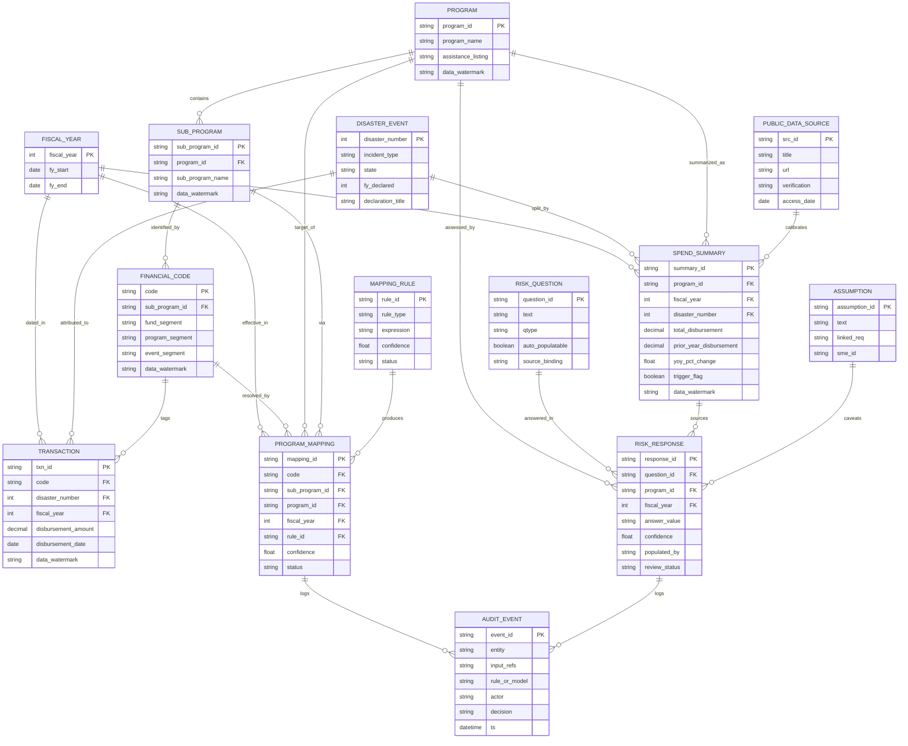

# 08 — Data Model

**Package:** FEMA Program ID & PRA Automation (demo)
**Document date:** 2026-07-08
**Status:** Conceptual demo. **Every record in this model is synthetic and watermarked** (`data_watermark = "SYNTHETIC-DEMO"`). Magnitudes are calibrated to verified public **obligation** data (`SRC-03` Public Assistance, `SRC-04` Hazard Mitigation) but the ledger models **disbursements**, which are non-public — the two are not the same measure (`ASSUMP-05`, `ASSUMP-10`). No real FEMA disbursement-by-program-ID data exists publicly and none is fabricated as real.
**Cross-references:** `REQ-` (02), `ASSUMP-` (03), `SRC-` (04), `SME-` (13).

> **Load-bearing correctness constraint (repeat from file 04 §3):** public dollars = *funding/obligations*; the client's problem = *actual spend/disbursements*. This model keeps a synthetic disbursement ledger that *draws down against* verified obligation envelopes over multiple fiscal years. Every spend figure in the demo is labeled a disbursement and watermarked synthetic.

---

## 1. Entity overview

| Entity | Grain | Role | Key requirement |
|---|---|---|---|
| `fiscal_year` | one row per FY | Time dimension | `REQ-014`, `REQ-017` |
| `disaster_event` | one row per DR number | Event dimension (real public DRs) | `REQ-005`, `SRC-02` |
| `program` | one row per parent reporting program | Program dimension | `REQ-004`, `REQ-006` |
| `sub_program` | one row per sub-program | Rollup child of program | `REQ-004` |
| `financial_code` | one row per code | Raw code carried on records | `REQ-001`, `REQ-003` |
| `program_mapping` | code → sub-program → program (per FY) | Resolved mapping outcome | `REQ-001`, `REQ-004` |
| `mapping_rule` | one row per rule (config) | Rules-as-data | `REQ-001`, `REQ-015` |
| `transaction` | one disbursement line | Fact table (synthetic spend) | `REQ-002`, `ASSUMP-05` |
| `spend_summary` | program × FY × event | Aggregated measures | `REQ-006`, `REQ-010` |
| `risk_question` | one row per PRA question | PRA template (illustrative) | `REQ-007`, `REQ-011`, `ASSUMP-04` |
| `risk_response` | question × program × FY | PRA answers | `REQ-007`, `REQ-008`, `REQ-009` |
| `assumption` | one row per assumption | In-app assumptions register | `REQ-016` |
| `audit_event` | one row per decision | Lineage / audit trail | `SME-18` |
| `public_data_source` | one row per SRC | Provenance catalog | `SRC-01`…`SRC-12` |

---

## 2. Logical model (ERD)



---

## 3. Physical model (DuckDB / PostgreSQL DDL sketch)

Option A uses DuckDB; Option B uses PostgreSQL — the DDL is portable ANSI SQL. Illustrative, not exhaustive.

```sql
CREATE TABLE fiscal_year (
  fiscal_year INTEGER PRIMARY KEY,
  fy_start DATE NOT NULL,
  fy_end   DATE NOT NULL
);

CREATE TABLE disaster_event (          -- real public DRs (SRC-02); no dollars here
  disaster_number  INTEGER PRIMARY KEY,
  incident_type    TEXT,
  state            TEXT,
  fy_declared      INTEGER,
  declaration_title TEXT
);

CREATE TABLE program (                 -- names from public assistance listings (ASSUMP-09)
  program_id         TEXT PRIMARY KEY,
  program_name       TEXT NOT NULL,
  assistance_listing TEXT,             -- '97.036' PA, '97.039' HMGP
  data_watermark     TEXT DEFAULT 'SYNTHETIC-DEMO'
);

CREATE TABLE sub_program (
  sub_program_id   TEXT PRIMARY KEY,
  program_id       TEXT REFERENCES program(program_id),
  sub_program_name TEXT,
  data_watermark   TEXT DEFAULT 'SYNTHETIC-DEMO'
);

CREATE TABLE financial_code (          -- synthetic code anatomy (SRC-04 strategy §4.3)
  code            TEXT PRIMARY KEY,
  sub_program_id  TEXT REFERENCES sub_program(sub_program_id),
  fund_segment    TEXT,
  program_segment TEXT,
  event_segment   TEXT,                -- references a real DR number (SRC-02)
  data_watermark  TEXT DEFAULT 'SYNTHETIC-DEMO'
);

CREATE TABLE transaction (             -- synthetic DISBURSEMENT ledger (ASSUMP-05)
  txn_id             TEXT PRIMARY KEY,
  code               TEXT REFERENCES financial_code(code),
  disaster_number    INTEGER REFERENCES disaster_event(disaster_number),
  fiscal_year        INTEGER REFERENCES fiscal_year(fiscal_year),
  disbursement_amount NUMERIC(14,2),
  disbursement_date  DATE,
  data_watermark     TEXT DEFAULT 'SYNTHETIC-DEMO'
);

CREATE TABLE mapping_rule (            -- rules-as-data (REQ-001, REQ-015)
  rule_id    TEXT PRIMARY KEY,
  rule_type  TEXT,                     -- 'code_to_subprogram' | 'rollup' | 'event_split'
  expression TEXT,                     -- YAML/JSON predicate
  confidence REAL,
  status     TEXT                      -- 'inferred' | 'sme_confirmed' | 'sop_validated'
);

CREATE TABLE program_mapping (
  mapping_id     TEXT PRIMARY KEY,
  code           TEXT REFERENCES financial_code(code),
  sub_program_id TEXT REFERENCES sub_program(sub_program_id),
  program_id     TEXT REFERENCES program(program_id),
  fiscal_year    INTEGER REFERENCES fiscal_year(fiscal_year),
  rule_id        TEXT REFERENCES mapping_rule(rule_id),
  confidence     REAL,
  status         TEXT                  -- 'auto' | 'exception_queue' | 'reviewed'
);

CREATE TABLE spend_summary (
  summary_id              TEXT PRIMARY KEY,
  program_id              TEXT REFERENCES program(program_id),
  fiscal_year             INTEGER REFERENCES fiscal_year(fiscal_year),
  disaster_number         INTEGER REFERENCES disaster_event(disaster_number),
  total_disbursement      NUMERIC(14,2),
  prior_year_disbursement NUMERIC(14,2),
  yoy_pct_change          REAL,
  trigger_flag            BOOLEAN,     -- >= configurable threshold (REQ-010)
  data_watermark          TEXT DEFAULT 'SYNTHETIC-DEMO'
);

CREATE TABLE risk_question (           -- ILLUSTRATIVE template (ASSUMP-04); see file 10
  question_id     TEXT PRIMARY KEY,
  text            TEXT,
  qtype           TEXT,                -- 'quantitative' | 'qualitative'
  auto_populatable BOOLEAN,
  source_binding  TEXT                 -- which spend measure answers it
);

CREATE TABLE risk_response (
  response_id   TEXT PRIMARY KEY,
  question_id   TEXT REFERENCES risk_question(question_id),
  program_id    TEXT REFERENCES program(program_id),
  fiscal_year   INTEGER REFERENCES fiscal_year(fiscal_year),
  answer_value  TEXT,
  confidence    REAL,
  populated_by  TEXT,                  -- 'auto' | 'human'
  review_status TEXT                   -- 'draft' | 'approved' | 'overridden'
);

CREATE TABLE assumption (
  assumption_id TEXT PRIMARY KEY,
  text          TEXT,
  linked_req    TEXT,
  sme_id        TEXT
);

CREATE TABLE audit_event (
  event_id      TEXT PRIMARY KEY,
  entity        TEXT,
  input_refs    TEXT,
  rule_or_model TEXT,
  actor         TEXT,
  decision      TEXT,
  ts            TIMESTAMP
);

CREATE TABLE public_data_source (
  src_id       TEXT PRIMARY KEY,
  title        TEXT,
  url          TEXT,
  verification TEXT,                   -- 'API' | 'Fetch' | 'Search'
  access_date  DATE
);
```

---

## 4. Synthetic code anatomy

A synthetic internal code is composed of three declared-fictional segments (`SRC-04` §4.3 strategy). The **event segment references a real DR number** (`SRC-02`) so the Harvey/Irma/Maria story lands with a recognizable anchor — but the composition itself is illustrative and must be validated (`SME-06`).

```
Example synthetic code:  PA-97036-4332
                          |    |     |
        fund/program family    |     event segment -> DR-4332 (real, SRC-02)
                    program segment (assistance listing 97.036, SRC-03/12)
```

| Segment | Example | Meaning | Source |
|---|---|---|---|
| `fund_segment` | `PA` | Program family label | Synthetic (`ASSUMP-09`) |
| `program_segment` | `97036` | Assistance listing 97.036 (Public Assistance) | `SRC-03`, `SRC-12` |
| `event_segment` | `4332` | DR-4332 (Harvey, TX, FY2017) | `SRC-02` (verified) |

> The demo does **not** claim FEMA's real codes look like this; segment composition is one more configurable extraction rule (`ASSUMP-08`, `SME-06`).

---

## 5. Verified disaster events (Harvey / Irma / Maria)

Loaded verbatim from `SRC-02` — real DR numbers only; **no DR is assigned to a storm beyond what SRC-02 supports**, and no dollar amounts live on this table.

| disaster_number | incident_type | state | fy_declared | notes (from SRC-02) |
|---|---|---|---|---|
| 4332 | Hurricane Harvey | TX | 2017 | Harvey/TX |
| 4337 | Hurricane Irma | FL | 2017 | Irma/FL |
| 4338 | Hurricane Irma | GA | 2017 | Irma/GA |
| 4339 | Hurricane Maria | PR | 2017 | Maria/PR |
| 4340 | Hurricane Maria | VI | 2017 | Maria/VI |
| 4341 | Hurricane Irma | FL | 2017 | Irma – Seminole Tribe |
| 4346 | Hurricane Irma | SC | 2018 | Irma follow-on (FY2018) |

> The transcript recalled "2018"; verified declarations are FY2017 except DR-4346 (`SRC-02`). The demo uses the verified years.

---

## 6. Example synthetic records (watermarked)

All rows below are fictional demo data. Dollar figures are **synthetic disbursements** shaped to sit within (not equal) public obligation envelopes for the same disasters (`ASSUMP-10`); they are illustrative placeholders pending calibration against live `SRC-03`/`SRC-04` pulls.

**program**

| program_id | program_name | assistance_listing | data_watermark |
|---|---|---|---|
| PROG-PA | Public Assistance (illustrative) | 97.036 | SYNTHETIC-DEMO |
| PROG-HM | Hazard Mitigation (illustrative) | 97.039 | SYNTHETIC-DEMO |

**sub_program** (demonstrates many-to-one rollup, `REQ-004`)

| sub_program_id | program_id | sub_program_name |
|---|---|---|
| SUB-PA-A | PROG-PA | Emergency Work (illustrative) |
| SUB-PA-B | PROG-PA | Permanent Work (illustrative) |
| SUB-PA-C | PROG-PA | Debris/Protective (illustrative) |
| SUB-HM-A | PROG-HM | Mitigation Projects (illustrative) |

**financial_code**

| code | sub_program_id | fund_segment | program_segment | event_segment |
|---|---|---|---|---|
| PA-97036-4332 | SUB-PA-A | PA | 97036 | 4332 |
| PA-97036-4337 | SUB-PA-B | PA | 97036 | 4337 |
| PA-97036-4339 | SUB-PA-C | PA | 97036 | 4339 |
| HM-97039-4340 | SUB-HM-A | HM | 97039 | 4340 |

**transaction** (synthetic disbursement ledger)

| txn_id | code | disaster_number | fiscal_year | disbursement_amount | data_watermark |
|---|---|---|---|---|---|
| TXN-0001 | PA-97036-4332 | 4332 | 2024 | 1,250,000.00 | SYNTHETIC-DEMO |
| TXN-0002 | PA-97036-4332 | 4332 | 2025 | 3,400,000.00 | SYNTHETIC-DEMO |
| TXN-0003 | PA-97036-4337 | 4337 | 2025 | 2,100,000.00 | SYNTHETIC-DEMO |
| TXN-0004 | HM-97039-4340 | 4340 | 2025 | 640,000.00 | SYNTHETIC-DEMO |

**spend_summary** (shows YoY trigger, `REQ-010`)

| summary_id | program_id | fiscal_year | disaster_number | total_disbursement | prior_year_disbursement | yoy_pct_change | trigger_flag |
|---|---|---|---|---|---|---|---|
| SS-PA-2025-4332 | PROG-PA | 2025 | 4332 | 3,400,000.00 | 1,250,000.00 | +172% | true |
| SS-PA-2025-4337 | PROG-PA | 2025 | 4337 | 2,100,000.00 | 1,950,000.00 | +7.7% | false |

> `trigger_flag = true` when `|yoy_pct_change| ≥ threshold` (default 20%, either direction, measure = disbursements). Threshold/direction/measure are configurable (`ASSUMP-03`, confirm `SME-01`).

**risk_question** (illustrative template — see file 10; **not** FEMA's real instrument, `ASSUMP-04`)

| question_id | qtype | auto_populatable | source_binding |
|---|---|---|---|
| Q1 | quantitative | true | spend_summary.total_disbursement |
| Q2 | quantitative | true | spend_summary.yoy_pct_change |
| Q9 | qualitative | false | program-office input (`REQ-009`) |
| Q10 | qualitative | false | program-office input (`REQ-009`) |

**public_data_source** (provenance)

| src_id | title | verification | access_date |
|---|---|---|---|
| SRC-02 | Disaster Declarations Summaries v2 | API | 2026-07-08 |
| SRC-03 | PA Funded Projects Details v2 | API | 2026-07-08 |
| SRC-04 | HMA Projects v4 | API | 2026-07-08 |

---

## 7. Calibration procedure (obligations → synthetic disbursements)

1. Pull per-disaster, per-program **obligation** distributions from `SRC-03` (PA, 97.036) and `SRC-04` (HMA, 97.039) for the verified DRs (§5).
2. Treat each disaster×program obligation total as an **envelope**. Generate synthetic **disbursement** draws that sum to ≤ the envelope and spread across ≥4 fiscal years (FY23–FY26), modeling no-year-money drawdown (`ASSUMP-05`, `ASSUMP-10`).
3. Ensure at least one program crosses the YoY trigger (`REQ-010`) and one does not, so the demo shows both branches.
4. Stamp every generated row `data_watermark = 'SYNTHETIC-DEMO'`.
5. Record the calibration inputs (source, pull date, envelope totals) in `public_data_source` and `audit_event` for provenance.

> **Never** present a synthetic disbursement as a real figure, and never present the obligation envelope as spend. The distinction is stated on-screen wherever spend appears (`ASSUMP-05`).

---

## 8. Data-model traceability

| Requirement | Satisfied by |
|---|---|
| `REQ-002` extract points | `transaction`, `financial_code` |
| `REQ-003` cleansing/exceptions | `program_mapping.status = 'exception_queue'` |
| `REQ-004` rollup | `program` ← `sub_program` ← `financial_code` |
| `REQ-005` event split | `disaster_event`, `event_segment`, `spend_summary.disaster_number` |
| `REQ-006` per-program output | `spend_summary` |
| `REQ-010` YoY trigger | `spend_summary.yoy_pct_change`, `trigger_flag` |
| `REQ-007/008/009` PRA | `risk_question`, `risk_response` |
| `REQ-013` mining | `mapping_rule.confidence`, `program_mapping.confidence` |
| `REQ-016` surface assumptions | `assumption` |
| `SME-18` audit | `audit_event` |
