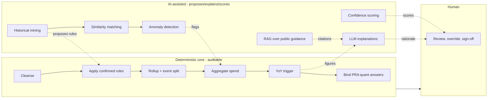
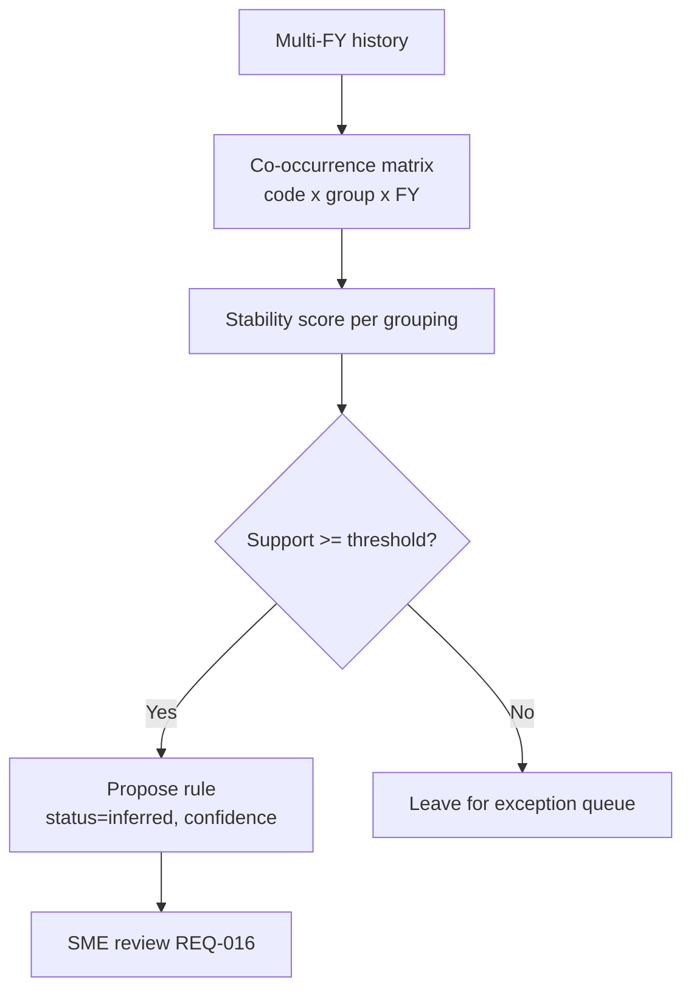
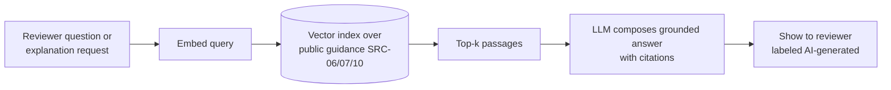

# 09 — AI Solution Design

**Package:** FEMA Program ID & PRA Automation (demo)
**Document date:** 2026-07-08
**Status:** Conceptual demo. The governing rule of this design: **deterministic code owns every reportable number; AI only proposes, explains, and scores.** (`A3` in file 06.)
**Cross-references:** `REQ-` (02), `ASSUMP-` (03), `SRC-` (04), `SME-` (13).

---

## 1. The deterministic / AI boundary

| Concern | Owner | Why |
|---|---|---|
| Cleansing & normalization | **Deterministic** | Auditable, repeatable |
| Applying confirmed mapping rules | **Deterministic** | Rules-as-data, not model discretion (`REQ-001`) |
| Rollup (sub-program → program) | **Deterministic** | Fixed hierarchy (`REQ-004`) |
| Event split | **Deterministic** | Rule-driven (`REQ-005`) |
| Spend aggregation | **Deterministic** | The reportable figure (`REQ-006`) |
| YoY variance & trigger | **Deterministic** | Demo centerpiece math must be checkable (`REQ-010`) |
| PRA quantitative answers | **Deterministic** binding | Numbers come from the ledger, not the model (`REQ-008`) |
| *Proposing* undocumented rules from history | **AI-assisted** | Inference over patterns (`REQ-013`) |
| *Detecting* anomalies / outliers | **AI-assisted** | Flags for humans, not decisions |
| *Explaining* results in plain language | **AI-assisted (LLM)** | Communication, not computation |
| *Retrieving* relevant guidance | **AI-assisted (RAG)** | Context for reviewers |
| *Scoring* confidence | **AI-assisted** | Prioritizes human review |
| Finalizing / signing off | **Human** | Mandatory HITL (`ASSUMP-17`) |

---

## 2. Rule-based mapping (deterministic)

The core engine applies **rules-as-data** (`REQ-001`, `REQ-015`). Rules live in config (`mapping_rule` table / YAML), each typed:

| rule_type | Example expression | Produces |
|---|---|---|
| `code_to_subprogram` | `program_segment == '97036' → SUB-PA-*` | code → sub-program |
| `rollup` | `SUB-PA-A,B,C → PROG-PA` | sub-program → program (`REQ-004`) |
| `event_split` | `event_segment → disaster_number` | event tag (`REQ-005`) |

Each rule carries a `status`: `inferred` → `sme_confirmed` → `sop_validated`. Records no rule can classify go to the **exception queue** (`program_mapping.status = 'exception_queue'`), mirroring today's manual adjustments (`REQ-003`). This is where `ASSUMP-16` (new) applies: **anything below the confidence threshold is queued, not auto-classified.**

---

## 3. Historical pattern mining (AI-assisted)

Implements the transcript's "crawler" idea (`REQ-013`): with no access to the rules, deduce them from consistency across years.

**Method:** co-occurrence / association analysis over ≥3 synthetic FYs (`ASSUMP-07`).
- For each code, compute how often it appears in the same reporting group across FY23–FY26.
- Codes that travel together ≥ *support threshold* (e.g., 99% per the transcript) are proposed as a group (`REQ-013`).
- Output is a **proposed** rule with a confidence score, never an authoritative mapping.

**Guardrail:** proposed rules are labeled *inferred — requires SME confirmation* (`ASSUMP-02`) and enter the config as `status = inferred` until confirmed (`SME-04`).

---

## 4. Similarity matching (AI-assisted)

For an unclassified or new code, find the most similar historically-classified codes (by segment structure, co-occurring codes, amount profile, event linkage) and **suggest** the mapping the reviewer might apply. Techniques: feature-vector nearest-neighbor over code attributes; optional embedding similarity on descriptive text if present. Always a suggestion routed through review, never an auto-assignment.

---

## 5. Anomaly detection (AI-assisted)

Flags records/programs a human should look at — distinct from the deterministic variance trigger:

| Signal | Example | Action |
|---|---|---|
| Amount outlier | A disbursement far outside a program's historical range | Flag for review |
| New code | A code never seen in prior FYs | Route to exception queue + similarity suggest |
| Event mismatch | Spend tagged to an event outside the program's usual set | Flag |
| Distribution shift | Program's spend spread changes shape (not just magnitude) | Flag |

Anomaly flags **never** change a number; they add a review reason.

---

## 6. Variance detection (deterministic)

The **20% YoY trigger is deterministic** (`REQ-010`) — full detail in file 10. AI does not compute it; it may *explain* it and *contextualize* it (e.g., "spike aligns with DR-4339 obligations in `SRC-03`"). Configurable threshold/direction/measure (`ASSUMP-03`, `SME-01`).

---

## 7. LLM-generated explanations (AI-assisted)

The LLM turns deterministic outputs into reviewer-ready prose. It receives the *computed* figures and rule IDs and produces:

- **Mapping rationale:** "Codes X,Y roll up to Public Assistance (97.036) via rule BR-2; grouped together in 99% of FY23–FY26 history (`REQ-013`)."
- **Trigger rationale:** "FY26 disbursements $X vs FY25 $Y = +27%, exceeding the 20% threshold (`REQ-010`); measure = disbursements (`ASSUMP-05`)."
- **PRA answer narrative:** a sentence per quantitative answer, citing the source measure.

**Hard guardrail:** the LLM is given numbers; it must not invent or recompute them. Prompts pass figures as fixed context; any numeric in the output is validated against the source value before display. Explanations are labeled *AI-generated* and are editable in review.

---

## 8. RAG over guidance (AI-assisted)

Retrieval-augmented generation grounds explanations in **public** guidance only for the demo (`ASSUMP-18`, new): PaymentAccuracy.gov (`SRC-06`), OMB M-21-19 / A-123 App. C (`SRC-07`), GAO high-risk framing (`SRC-10`). Internal SOP text is **excluded** until released (`SME-17`, new) — never fabricated.

When the real SOP arrives, it is added to the corpus and the `mapping_rule` status can advance to `sop_validated` (`REQ-015`).

---

## 9. Confidence scoring (AI-assisted)

Every AI output carries a confidence in [0,1], driving routing (`ASSUMP-16`):

| Source | Confidence basis |
|---|---|
| Historical mining | Support/stability of the grouping across FYs |
| Similarity match | Distance to nearest confirmed exemplar |
| PRA auto-answer | Completeness/quality of the source binding |

**Routing rule (demo default, configurable):** `confidence ≥ 0.85` → pre-filled and editable; `< 0.85` → exception queue / mandatory review. Thresholds are shown on-screen and confirmable via `SME-15`.

---

## 10. Human validation (mandatory)

`ASSUMP-17` (new): **no PRA is finalized without human review/sign-off.** The reviewer:
- sees each answer's value, confidence, evidence, and AI rationale;
- approves or overrides (override captures a reason);
- supplies the ~2 qualitative answers (`REQ-009`) via a stub form (`SME-12`).

Overrides feed the audit trail (`SME-18`) and can be recycled to improve rules — a compounding-quality loop.

---

## 11. Guardrails (summary)

| # | Guardrail | Enforces |
|---|---|---|
| G1 | AI never computes a reportable number | `A3`, `SME-15` |
| G2 | Inferred rules labeled and status-gated | `ASSUMP-02`, `REQ-016` |
| G3 | LLM numerics validated against source before display | Accuracy |
| G4 | RAG corpus = public only for demo; no fabricated SOP | `ASSUMP-18`, `SME-17` |
| G5 | Below-threshold outputs routed to humans | `ASSUMP-16` |
| G6 | Human sign-off required to finalize | `ASSUMP-17` |
| G7 | All AI output labeled AI-generated and editable | Transparency |
| G8 | Synthetic data only; no real data to any model | `ASSUMP-10`, `REQ-024` |

---

## 12. Model limitations

| Limitation | Impact | Mitigation |
|---|---|---|
| Inferred rules can be wrong (`ASSUMP-02`) | A program mis-mapped/missed for testing | Confidence + exception queue + SME confirmation (`SME-04`) |
| History may not predict future (regime change, migration `ASSUMP-12`) | Mining degrades | Re-baseline post-migration (`SME-10`); rules-as-data swap |
| LLM hallucination | Wrong rationale/citation | G1, G3, G4; human review |
| Small synthetic corpus | RAG coverage thin | Demo-scope only; expand with real guidance |
| Confidence is heuristic, not calibrated | Mis-prioritized review | Confirm thresholds with SME (`SME-15`); treat as triage aid |
| Anomaly flags ≠ ground truth | False positives/negatives | Flags add review reasons only, never decide |

---

### New IDs coined / consolidated in this file

| New ID | Meaning | Also in |
|---|---|---|
| `ASSUMP-16` | Below-confidence-threshold outputs route to exception queue, not auto-classify (default 0.85) | files 05, 06, 16 |
| `ASSUMP-17` | Mandatory human sign-off before any PRA is finalized | files 05, 06, 16 |
| `ASSUMP-18` | RAG corpus = public guidance only for the demo (`SRC-06/07/10`) | files 06, 16 |
| `SME-15` | Explainability/evidence + acceptable confidence thresholds for auditor acceptance | file 13 |
| `SME-17` | Which SOP/policy docs can be provided for RAG and are releasable | file 13 |
