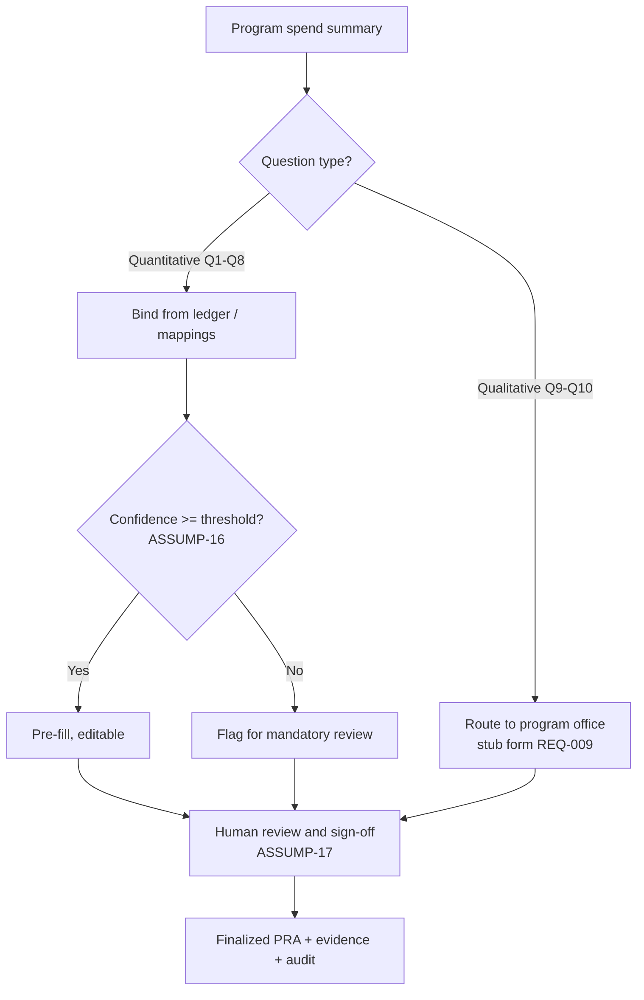
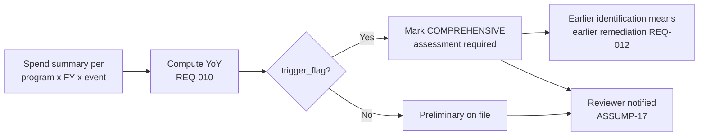

# 10 — Risk Assessment Automation

**Package:** FEMA Program ID & PRA Automation (demo)
**Document date:** 2026-07-08
**Status:** Conceptual demo.
**⚠️ The 10-question structure below is ILLUSTRATIVE and synthetic (`ASSUMP-04`).** The real FEMA preliminary-risk-assessment (PRA) question text is not available and is **not** invented here. This placeholder is structured around the improper-payment risk factors in the PIIA regime (OMB M-21-19 / A-123 App. C, `SRC-07`) and must be replaced with the verbatim instrument once obtained (`SME-05`).
**Cross-references:** `REQ-` (02), `ASSUMP-` (03), `SRC-` (04), `SME-` (13).

---

## 1. What the PRA does (in this concept)

For every reporting program, the PRA is a **fixed 10-question template** with per-program data bindings (`REQ-011`): one template, N data bindings, not N bespoke forms. ~8 questions are **quantitative and auto-populatable** from the synthetic disbursement ledger (`REQ-008`); ~2 are **qualitative** and require program-office input (`REQ-009`). A ≥20% year-over-year change in program spend **or in transaction volume** (the client's 2024 rule change, `REQ-031`) flags the program for a **comprehensive** risk assessment (`REQ-010`). Status wording reads as a **starting point** — a program begins with a preliminary or is already known to require a comprehensive (`REQ-032`).

The exact 8/2 split is parameterizable (`REQ-008` is hedged "probably like eight"); confirm with `SME-05`.

---

## 2. Illustrative 10-question structure (PLACEHOLDER — not FEMA's form)

| Q | Illustrative question (placeholder) | Type | Auto? | Data binding / source | Evidence shown | Confidence basis |
|---|---|---|---|---|---|---|
| Q1 | Total program disbursements this FY | Quant | ✅ Auto | `spend_summary.total_disbursement` | Ledger rows, program rollup | Binding completeness |
| Q2 | Year-over-year change in program spend (%) | Quant | ✅ Auto | `spend_summary.yoy_pct_change` | FY vs prior-FY totals | Two-year data present |
| Q3 | Does YoY change breach the comprehensive-assessment threshold on dollars **or transaction volume**? (REQ-031) | Quant | ✅ Auto | `fiscal_year_spend_summary.trigger_flag` (§5 — combined any-measure flag) | Threshold, measures, direction | Deterministic |
| Q4 | Number of sub-programs / codes rolled into this program | Quant | ✅ Auto | count of `sub_program` / `financial_code` | Mapping table | Mapping confidence |
| Q5 | Number of disaster events contributing to spend | Quant | ✅ Auto | distinct `disaster_number` in `spend_summary` | Event split (`REQ-005`) | Event-rule confidence |
| Q6 | Share of spend concentrated in the top event/sub-program (%) | Quant | ✅ Auto | derived from `spend_summary` | Concentration calc | Data present |
| Q7 | Count of exception-queue / unmapped records for this program | Quant | ✅ Auto | `program_mapping.status='exception_queue'` | Exception list (`REQ-003`) | Deterministic |
| Q8 | Prior-year comprehensive-assessment status / recency | Quant | ⚠️ Auto if history present | prior `risk_response` history | Prior assessment record | History availability (`SME-07`) |
| Q9 | Were there significant changes to program rules or regulation this FY? | Qual | ❌ Human | program-office input (`REQ-009`) | Reviewer note | n/a (human) |
| Q10 | Were there significant staffing / process changes affecting controls? | Qual | ❌ Human | program-office input (`REQ-009`) | Reviewer note | n/a (human) |

**Auto-population rate:** 7 fully auto + 1 conditional (Q8) ≈ **8 of 10** (`REQ-008`); Q9–Q10 qualitative (`REQ-009`). This matches the transcript's "probably like eight," and the split is configurable.

> Q9/Q10 mirror the transcript's own examples: "significant changes to program rules, regulation, staffing" (~8:57, `REQ-009`). They are placeholders, not the real questions (`SME-05`).

---

## 3. Auto-populate vs. SME/human input



| Population path | Questions | Who | Demo artifact |
|---|---|---|---|
| Auto (deterministic bind) | Q1–Q7 | System | Pre-filled with evidence |
| Auto-if-history | Q8 | System / fallback human | Pre-filled or flagged (`SME-07`) |
| Human qualitative | Q9–Q10 | Program office | Stub input form (`SME-12`) |
| Sign-off | all | Reviewer | Approve/override (`ASSUMP-17`) |

---

## 4. Required data fields per question

| Question | Required fields (from file 08) |
|---|---|
| Q1 | `transaction.disbursement_amount`, `program_mapping`, `fiscal_year` |
| Q2 | current + prior `spend_summary.total_disbursement` |
| Q3 | `spend_summary.yoy_pct_change`, trigger config |
| Q4 | `financial_code`, `sub_program`, `program` links |
| Q5 | `spend_summary.disaster_number`, `disaster_event` |
| Q6 | `spend_summary` by event/sub-program |
| Q7 | `program_mapping.status` |
| Q8 | prior-year `risk_response` |
| Q9–Q10 | human-entered `risk_response.answer_value` |

Every field traces to the data model (file 08 §8); every auto value writes an `audit_event` (`SME-18`).

---

## 5. The configurable 20% YoY variance rule (demo centerpiece)

**Do not hard-code.** Threshold, direction, and measure are configuration parameters, surfaced on-screen (`REQ-010`, `ASSUMP-03`; confirm `SME-01`).

```yaml
# variance_trigger.yaml  (rules-as-data) — revised 2026-07-11 (REQ-031)
comprehensive_assessment_trigger:
  measures: [disbursements, transaction_count]  # the client's 2024 change: volume AND dollars (REQ-031; SME-28)
  combine: any                  # a breach on either enabled measure flags the program (ASSUMP-21)
  threshold_pct: 20             # transcript hedged "I think it's like 20%" (REQ-010)
  direction: either             # either | increase_only | decrease_only (SME-01; decrease added because "Mike was concerned about the decrease")
  min_prior_year_amount: 0      # optional dollar floor to suppress noise on tiny programs
  min_prior_year_count: 0       # optional count floor (SME-28)
  compare: prior_fiscal_year    # YoY basis
```

**Computation (deterministic, per measure):**

```
yoy_pct_change        = (current_disbursement - prior_disbursement) / prior_disbursement * 100
count_yoy_pct_change  = (current_txn_count   - prior_txn_count)    / prior_txn_count    * 100
dollar_flag = match(direction) AND abs(yoy_pct_change)       >= threshold_pct AND prior_disbursement >= min_prior_year_amount
count_flag  = match(direction) AND abs(count_yoy_pct_change) >= threshold_pct AND prior_txn_count    >= min_prior_year_count
trigger_flag = dollar_flag OR count_flag        # combine: any
```

| direction | Fires when |
|---|---|
| `either` (default) | `abs(change) ≥ threshold` |
| `increase_only` | `change ≥ +threshold` |
| `decrease_only` | `change ≤ -threshold` |

**Worked example (synthetic, FY2026 planted outcomes — 2026-07-11 dataset):**

| Program | YoY $ | YoY txn volume | Threshold 20% either, any measure | Result |
|---|---|---|---|---|
| Public Assistance | +34.0% | +32.4% | breach (both) | 🔴 Comprehensive required |
| HMGP | −31.0% | −28.3% | breach (both, decrease) | 🔴 Comprehensive required |
| **Individual Assistance** | **+8.0%** | **+37.5%** | **breach on volume only — the 2024-rule catch** | 🔴 Comprehensive required |
| US&R | +19.0% | +9.1% | no (near-miss on dollars) | 🟢 Begins with preliminary |

> Changing `threshold_pct` or `direction` in the YAML and re-running visibly re-flags programs — this is the live proof of rules-as-data (`REQ-015`) and directly de-risks `SME-01`.

---

## 6. Comprehensive-risk-assessment trigger flow



The value story: because the trigger runs the moment the FY-end batch lands, comprehensive-assessment programs are identified **weeks-to-months earlier** than today's post-close manual process (`REQ-012`), enabling in-year remediation. Quantifying the exact time saved is `SME-08`.

---

## 7. Evidence & confidence on every answer

| Element | What the reviewer sees |
|---|---|
| Value | The auto or human answer |
| Source | Which ledger rows / mappings produced it (lineage) |
| Confidence | AI score (mapping/mining) or "deterministic" for pure math |
| Rationale | AI-generated plain-language explanation (file 09 §7), labeled AI-generated |
| Guidance link | RAG citation to public guidance (`SRC-06/07/10`, `ASSUMP-18`) |
| Assumptions | Any `assumption` records that caveat this program (`REQ-016`) |

---

## 8. Guardrails specific to the PRA

- The instrument is **labeled illustrative** everywhere it appears (`ASSUMP-04`); the demo never claims it is FEMA's form.
- Quantitative answers are **deterministic binds**, not model outputs (`A3`, file 09 §1).
- The trigger is **configurable and on-screen**, never a magic number (`REQ-010`).
- Qualitative answers are **always human** (`REQ-009`).
- Nothing finalizes without **human sign-off** (`ASSUMP-17`).

---

### New IDs referenced (defined elsewhere)

`ASSUMP-16`, `ASSUMP-17` (files 05/06/09), `SME-15` (file 13). No new IDs coined here.
