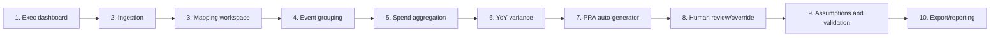

# 11 — Demo Storyboard

**Package:** FEMA Program ID & PRA Automation (demo)
**Document date:** 2026-07-08
**Status:** Conceptual demo. Every screen displays **synthetic, watermarked** data calibrated to public obligations (`ASSUMP-05`, `ASSUMP-10`). No production readiness implied.
**Cross-references:** `REQ-` (02), `ASSUMP-` (03), `SRC-` (04), `SME-` (13); talk track in file 14.

---

## 1. Narrative arc

Ten screens tell one story: *a FY-end extract lands → it is mapped, aggregated, and split by event → the PRA auto-populates → the 20% trigger fires → a human reviews and exports.* The demo makes the **undocumented, weeks-long manual process** visible, fast, and auditable.

---

## 2. Screen-by-screen

### Screen 1 — Executive dashboard
| Aspect | Detail |
|---|---|
| Purpose | One-glance program health for the exec audience |
| User action | Select fiscal year; scan program tiles |
| Data shown | Programs, total synthetic disbursements, count triggered for comprehensive assessment, exception count |
| AI capability | None (deterministic summary) — sets the honest baseline |
| Talking point | "This is the answer the current process takes weeks-to-months to produce (`REQ-012`)." |
| Stakeholder value | Immediate situational awareness for Mike Walker's office |
| Traces to | `REQ-006`, `REQ-010`, `REQ-018` |

### Screen 2 — Data ingestion
| Aspect | Detail |
|---|---|
| Purpose | Show the file-in contract and schema mapping |
| User action | Load a synthetic FY-end extract; map its columns |
| Data shown | Raw record-level rows, watermark banner, schema-mapping panel |
| AI capability | Schema validation against OpenFEMA metadata (`SRC-01`) |
| Talking point | "Swapping the real extract layout is a config change, not a rebuild (`ASSUMP-01`) — this survives the system migration (`REQ-019`)." |
| Stakeholder value | De-risks the unknown export format for the finance center |
| Traces to | `REQ-002`, `REQ-003`, `ASSUMP-01`, `REQ-019` |

### Screen 3 — Program mapping workspace
| Aspect | Detail |
|---|---|
| Purpose | Turn opaque Program ID rules into visible, editable config |
| User action | View code→sub-program→program mappings; edit a rule; see records reflow |
| Data shown | Mapping table with confidence, `status` (inferred/confirmed), exception queue |
| AI capability | Historical mining proposes groupings with confidence (`REQ-013`); similarity suggestions |
| Talking point | "We don't have the rules — so we inferred them from history and made them editable. When your SOP arrives, it drops in here (`REQ-015`)." |
| Stakeholder value | Replaces tribal knowledge with a defensible, swappable rule set |
| Traces to | `REQ-001`, `REQ-004`, `REQ-013`, `REQ-015`, `ASSUMP-02`, `ASSUMP-16` |

### Screen 4 — Disaster / event grouping
| Aspect | Detail |
|---|---|
| Purpose | Show event-level breakdown within a program |
| User action | Expand a program; view spend split by disaster |
| Data shown | Real DR numbers (DR-4332 Harvey, DR-4337 Irma, DR-4339/4340 Maria — `SRC-02`) with synthetic spend |
| AI capability | Event-segment extraction rule; anomaly flag if event is unexpected |
| Talking point | "Harvey, Irma, and Maria hit close together and had to be tracked separately (`REQ-005`) — here's that split, anchored to real declaration numbers." |
| Stakeholder value | Demonstrates the hardest reporting nuance realistically |
| Traces to | `REQ-005`, `ASSUMP-08`, `SRC-02` |

### Screen 5 — Spend aggregation
| Aspect | Detail |
|---|---|
| Purpose | Roll transactions up to per-program, per-event totals |
| User action | Choose grouping (program / sub-program / event); view totals |
| Data shown | `spend_summary` totals, watermark, "disbursements — not obligations" caption (`ASSUMP-05`) |
| AI capability | None (deterministic aggregation) |
| Talking point | "Public data shows *funding/obligations*; the client's problem is *actual spend*. This ledger is synthetic disbursements calibrated to public obligations (`SRC-03/04`)." |
| Stakeholder value | Correctly frames the funding-vs-spend distinction upfront |
| Traces to | `REQ-006`, `ASSUMP-05`, `ASSUMP-10`, `SRC-03`, `SRC-04` |

### Screen 6 — Year-over-year variance
| Aspect | Detail |
|---|---|
| Purpose | The analytical centerpiece: the configurable trigger |
| User action | Adjust threshold/direction slider and the measure checkboxes (dollars / transaction volume); re-run; watch programs re-flag |
| Data shown | YoY % per program on both measures, per-measure trigger flags (count-only breaches drawn amber), threshold config panel |
| AI capability | Deterministic math; AI explains *why* a spike occurred (context) |
| Talking point | "The threshold is configurable — default 20%, either direction, on dollars **or transaction volume** per your 2024 change (`REQ-010`, `REQ-031`, `SME-01/28`). Individual Assistance moves +8% in dollars but +37.5% in volume — the dollar-only rule misses it; yours catches it. Watch it re-flag live." |
| Stakeholder value | Proves the math is transparent and client-tunable, not a black box |
| Traces to | `REQ-010`, `ASSUMP-03`, `SME-01` |

### Screen 7 — PRA: computed answers (read-only evidence view)
| Aspect | Detail |
|---|---|
| Purpose | Auto-populate the PRA from spend data; show how every value was computed. All input happens on screen 8 (CH-07, 2026-07-11) |
| User action | Open a program's PRA; see ~8/10 pre-filled, ~2 flagged for input |
| Data shown | Illustrative 10-question form (labeled placeholder, `ASSUMP-04`), evidence + confidence per answer |
| AI capability | Deterministic binds for quant answers; LLM rationale; RAG citation to public guidance |
| Talking point | "About 8 of 10 questions auto-populate from data you already hold (`REQ-008`); 2 need program-office input (`REQ-009`). This form is illustrative pending your real instrument (`SME-05`)." |
| Stakeholder value | Shows the headline automation outcome |
| Traces to | `REQ-007`, `REQ-008`, `REQ-009`, `REQ-011`, `ASSUMP-04` |

### Screen 8 — Human review and override
| Aspect | Detail |
|---|---|
| Purpose | Prove human-in-the-loop, not auto-sign-off |
| User action | Review an answer, override with a reason, approve/finalize |
| Data shown | Answer + confidence + evidence + AI rationale; override reason capture |
| AI capability | Confidence-based flagging (`ASSUMP-16`) |
| Talking point | "Auto-populated is not auto-accepted. A human signs off, and every override is captured (`ASSUMP-17`)." |
| Stakeholder value | Addresses over-automation and audit concerns head-on |
| Traces to | `ASSUMP-16`, `ASSUMP-17`, `REQ-009`, `SME-12` |

### Screen 9 — Assumptions and validation
| Aspect | Detail |
|---|---|
| Purpose | Surface every assumption and open SME question in-app |
| User action | Browse the assumptions register; filter by program/SME |
| Data shown | `assumption` records with linked `REQ-`/`SME-`; "confirm at check-in" checkboxes |
| AI capability | None — transparency feature |
| Talking point | "We documented every assumption rather than guessing silently (`REQ-016`); we'll check these off with your SMEs Friday." |
| Stakeholder value | Builds trust; operationalizes the iteration cadence (`REQ-025`) |
| Traces to | `REQ-016`, `REQ-025`, `SME-01`…`SME-18` |

### Screen 10 — Export / reporting
| Aspect | Detail |
|---|---|
| Purpose | Produce the deliverable outputs |
| User action | Export per-program report + PRA to XLSX/PDF/CSV; view dashboard |
| Data shown | Program name, disbursement amount, trigger status, PRA answers (`REQ-006`) |
| AI capability | None (rendering) |
| Talking point | "Excel-compatible outputs echo the legacy 'macro' expectation (`ASSUMP-15`), but the logic is modern and auditable. Exact format is a quick SME confirm (`SME-14`)." |
| Stakeholder value | Tangible artifact the audience can hold |
| Traces to | `REQ-006`, `REQ-021`, `ASSUMP-15`, `SME-14` |

---

## 3. Demo data setup (for the developer)

| Need | Setup |
|---|---|
| Fiscal years | FY22–FY26 synthetic (`ASSUMP-07`) |
| Programs | **Real public taxonomy (REQ-027, 2026-07-11):** Public Assistance (97.036, sub-grouped by disaster number), HMGP (97.039, no subs), Individual Assistance (IHP/Mass Care/DCM), HSGP (97.067, SHSP/UASI/OPSG — non-disaster), US&R (97.025, no subs — non-disaster) |
| Events | DR-4332/4337/4338/4339/4340/4341/4346 (`SRC-02`); non-disaster programs carry no DR (`REQ-030`) |
| Trigger cases | ≥1 breaching up, ≥1 down, ≥1 within, and **1 count-only breach** (Individual Assistance, `REQ-031`) |
| Watermark | Every record `SYNTHETIC-DEMO` |
| Config | `variance_trigger.yaml`, mapping rules YAML (editable live) |

---

## 4. Demo flow timing (target ~15 min)

| Segment | Screens | ~Min |
|---|---|---|
| Frame the problem | 1 | 2 |
| Ingest & map | 2–3 | 4 |
| Events & spend | 4–5 | 3 |
| Variance & PRA | 6–7 | 4 |
| Review & export | 8–10 | 2 |

Aligns with the talk track (file 14).
