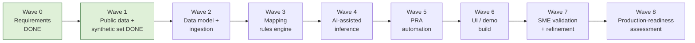

# 12 — Implementation Roadmap

**Package:** FEMA Program ID & PRA Automation (demo)
**Document date:** 2026-07-08
**Status:** Conceptual demo. Waves 0–1 are **COMPLETE** (Wave 0 via the foundation pass, commit `d2bf3b7`; Wave 1 dataset generation via `data/` — seeded generator + committed synthetic outputs). Waves 2–8 are forward-looking. Effort is indicative (developer-days for the demo build; production waves are directional).
**Cross-references:** `REQ-` (02), `ASSUMP-` (03), `SRC-` (04), `SME-` (13).

---

## 1. Wave overview

| Wave | Status | Est. effort (demo) |
|---|---|---|
| 0 Requirements & assumptions | ✅ Substantially complete | — (done) |
| 1 Public data + synthetic dataset | ✅ **COMPLETE** (research done, file 04; dataset generated and committed, `data/`) | — (done) |
| 2 Data model + ingestion | ⬜ Planned | 2–3 d |
| 3 Mapping rules engine | ⬜ Planned | 2–3 d |
| 4 AI-assisted inference | ⬜ Planned | 2–3 d |
| 5 PRA automation | ⬜ Planned | 2 d |
| 6 UI / demo build | ⬜ Planned (Streamlit Option A) · ✅ **leave-behind single-file HTML variant shipped** (`leavebehind/fema-demo.html`) | 3–4 d |
| 7 SME validation + refinement | ⬜ Planned | ongoing |
| 8 Production-readiness assessment | ⬜ Future | scoping only |

---

## 2. Wave detail

### Wave 0 — Requirements & assumptions ✅
| | |
|---|---|
| Objective | Extract requirements, log assumptions + SME questions from the transcript |
| Tasks | Transcript extraction; assumptions register; SME questions |
| Deliverables | Files 02, 03 (committed `d2bf3b7`) |
| Acceptance | Every gap carries an `ASSUMP-`/`SME-`; IDs frozen |
| Dependencies | Transcript |
| Risks | Transcript is partial/auto-generated (mitigated by caveats) |
| Effort | Done |

### Wave 1 — Public data + synthetic dataset ✅ COMPLETE
| | |
|---|---|
| Objective | Verify public sources; define synthetic-data strategy; generate the dataset |
| Tasks | Live-verify sources (done, file 04); generate the calibrated synthetic ledger per file 08 §7 (done, `data/`) |
| Deliverables | File 04 (committed); `data/generator/generate_synthetic.py` + `rules.yaml` + `anchors.json` (seed 20260708); `data/synthetic/*.csv` — FY2022–FY2026 ledger (2,019 txns, 18 programs, 51 subs) + reference tables + validation-only answer key; `data/DATA_DICTIONARY.md`, `data/README.md` |
| Acceptance | ✅ Sources verified with dates; ✅ every row watermarked `SYNTHETIC-DEMO`; ✅ trigger breaches planted both directions (FY2026: +34/+52/+21%, −31/−24%) plus within-threshold programs; ✅ calibrated to live SRC-03/04 obligation envelopes (≤29.5% per-DR utilization); ✅ 10/10 generator self-checks pass; ✅ byte-identical re-runs |
| Dependencies | `SRC-02/03/04`; file 08 §7 |
| Risks | Calibration realism (`ASSUMP-10`) → `SME-11` |
| Effort | Done |

### Wave 2 — Data model + ingestion
| | |
|---|---|
| Objective | Stand up the schema and file-in ingestion |
| Tasks | Implement tables (file 08); schema-mapping adapter; watermark validation; cleansing + exception queue |
| Deliverables | DuckDB schema, ingestion module, sample load |
| Acceptance | Synthetic extract loads; unmapped rows queue (`REQ-003`); schema swap is config |
| Dependencies | Wave 1 dataset; `ASSUMP-01` |
| Risks | Real extract shape unknown → `SME-03` |
| Effort | 2–3 d |

### Wave 3 — Mapping rules engine
| | |
|---|---|
| Objective | Rules-as-data engine for code→sub-program→program + event split |
| Tasks | YAML rule schema; evaluator; rollup (`REQ-004`); event split (`REQ-005`); rule status lifecycle |
| Deliverables | Rules engine + editable configs |
| Acceptance | Editing a rule reflows mappings live; rollup + event split correct on synthetic data |
| Dependencies | Wave 2; `REQ-001`, `REQ-015` |
| Risks | Inferred rules wrong → confidence + `SME-04` |
| Effort | 2–3 d |

### Wave 4 — AI-assisted inference
| | |
|---|---|
| Objective | Historical mining, similarity, anomaly, confidence scoring |
| Tasks | Co-occurrence mining (`REQ-013`); similarity matcher; anomaly flags; confidence scores; routing threshold (`ASSUMP-16`) |
| Deliverables | Inference module producing *proposed* rules w/ confidence |
| Acceptance | Proposed rules labeled inferred; below-threshold routes to queue; explanations present |
| Dependencies | Wave 3; ≥3 FYs (`ASSUMP-07`) |
| Risks | History ≠ future (`ASSUMP-02`, `ASSUMP-12`) → `SME-04`, `SME-10` |
| Effort | 2–3 d |

### Wave 5 — PRA automation
| | |
|---|---|
| Objective | Auto-populate the illustrative PRA + variance trigger |
| Tasks | Question template (file 10); quant binds (`REQ-008`); qual stubs (`REQ-009`); configurable trigger (`REQ-010`); LLM rationale + RAG (`ASSUMP-18`) |
| Deliverables | PRA generator + `variance_trigger.yaml` |
| Acceptance | ~8/10 auto; trigger re-flags on config change; every answer has evidence + confidence |
| Dependencies | Waves 2–4 |
| Risks | Real instrument differs (`ASSUMP-04`) → `SME-05`; threshold (`SME-01`) |
| Effort | 2 d |

### Wave 6 — UI / demo build
| | |
|---|---|
| Objective | Build the 10-screen storyboard (file 11) |
| Tasks | Streamlit app (Option A, file 07); screens 1–10; live config controls; exports (XLSX/PDF/CSV) |
| Deliverables | Runnable demo app |
| Acceptance | Full storyboard runs on a laptop in ~15 min; watermark visible; exports produced |
| Dependencies | Waves 2–5; `REQ-025` |
| Risks | Time-box vs polish → Option A chosen for speed |
| Effort | 3–4 d |

> **Leave-behind variant (shipped ahead of this wave):** `leavebehind/fema-demo.html` — a single self-contained HTML file implementing all 10 storyboard screens with the Wave 1 dataset embedded and every reportable number (rollups, YoY, trigger flags, PRA binds) computed deterministically in embedded JavaScript. Fully offline (no CDN/network/storage); AI explanations are precomputed and labeled as such since an offline file cannot call a model. Regenerated from current data by `leavebehind/build_demo_html.py` (byte-stable). This is the emailable/locked-down-machine variant; the Wave 6 Streamlit build remains the presented/connected demo path. See `leavebehind/README.md` and `16-decision-log.md` DEC-24…DEC-28. **Enhancement pass (2026-07-09, DEC-29):** the mapping-visualization shortlist from `enhancements/MAPPING_DEMO_IDEAS.md` — follow-the-dollar lineage trace, dollar-weighted flow map, universal code search, what-changed ripple drawer — was built into the leave-behind (screen 3 + top bar), all deterministic re-use of the embedded engine with no new data fields. **FLOW-05 pass (2026-07-09, DEC-30):** the crawler holdout reveal was added as screen 3's *Inference test* tab — a Wave 4 preview: the crawler mines only the FY2022–25 mapping history, proposes FY2026 groupings blind, and is scored in-session against the held-out FY2026 mapping (inference and scoring are separate code paths; the answer-key files remain unread, DEC-22).

### Wave 7 — SME validation + refinement
| | |
|---|---|
| Objective | Walk SMEs through assumptions; replace inferred items with confirmed facts |
| Tasks | Run check-ins (Fri + following week, `REQ-025`); resolve `SME-01`…`SME-18`; swap confirmed rules/instrument |
| Deliverables | Updated configs; validation log; revised assumptions |
| Acceptance | Blocking questions (`SME-01/03/05/11`) answered or explicitly deferred |
| Dependencies | Wave 6; SME availability |
| Risks | SMEs unavailable → demo proceeds on documented workarounds |
| Effort | Ongoing |

### Wave 8 — Production-readiness assessment
| | |
|---|---|
| Objective | Scope what production would require (NOT build it) |
| Tasks | Security/FedRAMP assessment; cloud/tenant confirm (`SME-09`); RBAC (`SME-16`); audit/retention (`SME-18`); live-system integration (`REQ-023`); continuous feed (`REQ-022`) |
| Deliverables | Production-readiness assessment + gap list |
| Acceptance | Explicit go/no-go criteria and controls documented |
| Dependencies | Waves 1–7; `ASSUMP-11` |
| Risks | Federal ATO timelines; tenant constraints |
| Effort | Scoping only (not a demo deliverable) |

---

## 3. Critical path & top risks

- **Critical path:** Wave 1 dataset → Wave 2 ingestion → Wave 3 rules → Wave 5 PRA → Wave 6 UI. AI (Wave 4) enriches but does not block the core demo.
- **Highest-priority wave to start now:** **Wave 2 (data model + ingestion)** — it unblocks Waves 3–6 and the demo date is fixed (`REQ-025`).
- **Top build risks:** unknown extract shape (`SME-03`), trigger definition (`SME-01`), real PRA text (`SME-05`), spend definition (`SME-11`) — all have demo-safe workarounds so none blocks the *concept* demo.

> No wave implies production readiness. Wave 8 is an *assessment*, not a deployment.
