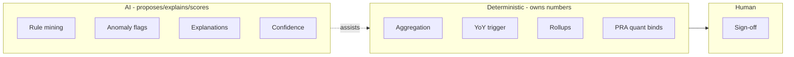
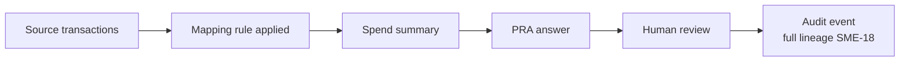

# 17 — Appendix

**Package:** FEMA Program ID & PRA Automation (demo)
**Document date:** 2026-07-08
**Status:** Conceptual demo. Reference material supporting files 01–16.
**Cross-references:** `REQ-` (02), `ASSUMP-` (03), `SRC-` (04), `SME-` (13).

---

## 1. Glossary

| Term | Meaning in this package |
|---|---|
| Program ID | Internal identifier grouping financial records into a reporting program; derived by undocumented rules (`REQ-001`) |
| Sub-program | A component with its own code(s) that rolls up to a parent program (`REQ-004`) |
| Financial code | A code on a record; synthetic anatomy = fund/program/event segments (file 08 §4) |
| Disaster/event | A declared disaster (real DR number, `SRC-02`); a spend-reporting axis (`REQ-005`) |
| Obligation | A binding funding commitment; **public** (`SRC-03/04`) — *not* actual spend |
| Disbursement | Money actually paid out; the client's measure; **non-public** (`ASSUMP-05`) |
| No-year money | Appropriations without a spend-by deadline; complicates YoY reconciliation (`REQ-026`) |
| PRA | Preliminary Risk Assessment — the 10-question instrument (illustrative here, `ASSUMP-04`) |
| Comprehensive risk assessment | Deeper assessment triggered by the variance rule (`REQ-010`) |
| Rules-as-data | Business logic stored as editable config, not hard-coded (`REQ-015`) |
| Exception queue | Records the rules can't classify, routed for human handling (`REQ-003`, `ASSUMP-16`) |
| HITL | Human-in-the-loop; mandatory review/sign-off (`ASSUMP-17`) |
| Watermark | `SYNTHETIC-DEMO` tag on every fabricated record (`ASSUMP-10`) |

---

## 2. Acronyms

| Acronym | Expansion |
|---|---|
| PRA | Preliminary Risk Assessment |
| PIIA | Payment Integrity Information Act of 2019 |
| OMB | Office of Management and Budget |
| A-123 | OMB Circular A-123 (internal control); Appendix C = payment integrity |
| M-21-19 | OMB memorandum implementing PIIA (`SRC-07`) |
| GAO | Government Accountability Office (`SRC-10`) |
| OIG | Office of Inspector General (`SRC-09`) |
| DHS | Department of Homeland Security |
| DRF | Disaster Relief Fund |
| DR | Disaster (declaration number, e.g., DR-4332) |
| PA | Public Assistance (assistance listing 97.036) |
| HMGP / HMA | Hazard Mitigation Grant Program / Assistance (97.039) |
| FY | Fiscal Year |
| YoY | Year-over-Year |
| RAG | Retrieval-Augmented Generation |
| RBAC | Role-Based Access Control |
| FedRAMP | Federal Risk and Authorization Management Program |
| ATO | Authority to Operate |
| CUI | Controlled Unclassified Information |
| SME | Subject-Matter Expert |

---

## 3. Example mapping rules (rules-as-data)

```yaml
# mapping_rules.yaml  — illustrative; inferred, pending SME confirmation (SME-04)
rules:
  - rule_id: BR-1
    rule_type: code_to_subprogram
    expression: "program_segment == '97036' and fund_segment == 'PA'"
    target: SUB-PA-*
    status: inferred
    confidence: 0.94

  - rule_id: BR-2
    rule_type: rollup
    expression: "sub_program_id in [SUB-PA-A, SUB-PA-B, SUB-PA-C]"
    target: PROG-PA          # Public Assistance (97.036)
    status: inferred
    confidence: 0.97

  - rule_id: BR-3
    rule_type: event_split
    expression: "event_segment"      # maps segment -> disaster_number (SRC-02)
    target: disaster_event.disaster_number
    status: inferred
    confidence: 0.90
```

```yaml
# variance_trigger.yaml  — configurable comprehensive-assessment trigger (REQ-010)
comprehensive_assessment_trigger:
  measure: disbursements     # ASSUMP-05
  threshold_pct: 20          # SME-01
  direction: either
  min_prior_year_amount: 0
  compare: prior_fiscal_year
```

---

## 4. Example synthetic dataset structure

```
/synthetic-data/            (every file watermarked SYNTHETIC-DEMO)
  fiscal_year.csv           FY23–FY26
  disaster_event.csv        DR-4332/4337/4338/4339/4340/4341/4346 (SRC-02)
  program.csv               PROG-PA (97.036), PROG-HM (97.039)
  sub_program.csv           SUB-PA-A/B/C, SUB-HM-A
  financial_code.csv        e.g., PA-97036-4332
  transaction.csv           synthetic disbursement ledger (ASSUMP-05)
  spend_summary.csv         program x FY x event, yoy_pct_change, trigger_flag
  risk_question.csv         illustrative 10-question template (ASSUMP-04)
  risk_response.csv         per program x FY answers
  mapping_rules.yaml        rules-as-data
  variance_trigger.yaml     configurable trigger
```

Row-count guidance: low thousands of transactions across 4 FYs — enough for YoY variance (`REQ-010`) and grouping inference (`REQ-013`) without exceeding laptop scale (`ASSUMP-07`).

---

## 5. Reference diagrams

**Deterministic vs AI ownership (recap of file 09 §1):**



**Data lineage for one PRA value (recap of audit model, file 06 §7):**



---

## 6. Reference links (verified sources — see file 04 for full detail)

| SRC-ID | Source | Verification |
|---|---|---|
| `SRC-01` | OpenFEMA API platform/metadata | API-verified |
| `SRC-02` | Disaster Declarations Summaries v2 | API-verified |
| `SRC-03` | Public Assistance Funded Projects Details v2 (97.036) | API-verified |
| `SRC-04` | Hazard Mitigation Assistance Projects v4 (97.039 family) | API-verified |
| `SRC-05` | USAspending.gov API v2 | Fetch-verified (fields *unverified — validate*) |
| `SRC-06` | PaymentAccuracy.gov | Fetch-verified (homepage) |
| `SRC-07` | OMB M-21-19 (A-123 App. C) | Search-verified |
| `SRC-08` | DHS FY2026 CBJ — FEMA volume | Search-verified |
| `SRC-09` | DHS OIG-25-23 (PIIA FY2024) | Search-verified |
| `SRC-10` | GAO High-Risk Series 2025 | Search-verified |
| `SRC-11` | Treasury Fiscal Data API | API-verified (narrative only) |
| `SRC-12` | SAM.gov Assistance Listings | Search-verified (97.036 API-verified) |

> Field-level claims for search-verified sources are marked *unverified — validate* in file 04 and must be confirmed against the primary document before any figure is quoted in demo materials.

---

## 7. Open questions (consolidated)

Blocking (before build hardening): `SME-01`, `SME-03`, `SME-05`, `SME-11`.
High value: `SME-02`, `SME-04`, `SME-14`, `SME-15`, `SME-16`.
Roadmap/pilot: `SME-06`, `SME-07`, `SME-08`, `SME-09`, `SME-10`, `SME-12`, `SME-13`, `SME-17`, `SME-18`.

Full text and workarounds in file 13; underlying assumptions in file 03.
