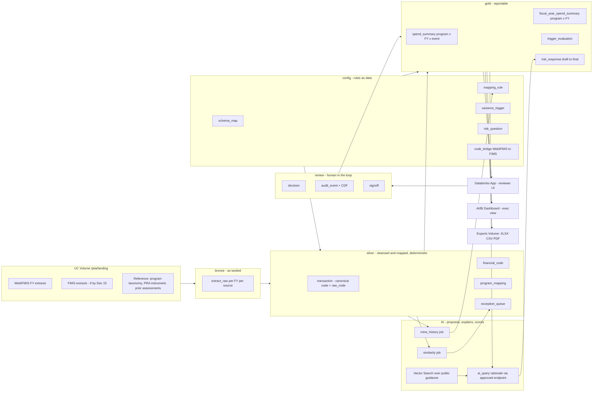

# 18 — Databricks (FEMADex) Implementation Plan — Funded Pilot

**Package:** FEMA Program ID & Preliminary Risk Assessment (PRA) Automation
**Document date:** 2026-09-15
**Status:** Planning draft for the **funded pilot**. Written against the two draft funding documents (the consolidated SOW/ROM, "FEMA PIIA" section, and the FSM firm-fixed-price pricing template with its Assumptions tab) and the repo at commit `36ebff2`. Nothing in this file is built yet. Companion review of the two documents: `review/PILOT_FUNDING_DOCS_REVIEW.md`.
**Cross-references:** `REQ-` (02, updates/), `ASSUMP-` (03, updates/), `SME-` (13, updates/), `DEC-` (16). IDs coined here: `PLT-` (platform decisions), `AC-` (proposed acceptance criteria), `DBX-R-` (pilot-specific risks), `DQ-` (decisions needed).

---

## 0. What the funding documents change

The July package designed a laptop concept demo. The September documents fund a proof of concept **inside FEMA's Databricks environment (FEMADex)** on **real extracts**. Almost every open platform question in the package is now answered, and several design assumptions are now wrong.

| Dimension | Repo design (July) | Funded pilot (September documents) | Consequence for the build |
|---|---|---|---|
| Vehicle | Concept demo, Option A laptop stack (DEC-11) | FSM contract modification, firm-fixed price, one of **four** solutions sharing one team | Fixed end date; scope discipline matters more than polish |
| Platform | Cloud unconfirmed (`SME-09`, `ASSUMP-11`) | **FEMADex = FEMA's Databricks**; Unity Catalog governance is stated as provided | `SME-09` answered. Option B's "Databricks Lakehouse" cell becomes the whole stack |
| Data | Synthetic, watermarked, 5 FYs, 5 programs | **Real WebIFMIS extracts** (FIMS if delivered by Dec 15), **20 programs, FY2024–FY2026**, CUI handling applies | Synthetic set becomes the CI fixture, not the demo data. Three FYs, not five (`DBX-R-04`) |
| Timeline | Demo "next week" | Period of performance **Sept 30 2026 – Feb 18 2027** (20 weeks, two federal holiday weeks inside) | The SOW's 16-week Phase 1 must land in ~18 working weeks with handover at the end |
| Scope | 10-screen storyboard | SOW Phase 1 POC deliverables; pricing Assumptions tab: **POC only, production deployment excluded** | Phase 2 items (RBAC rollout, FIMS reconciliation, training) are not funded in this modification (`DBX-R-01`) |
| Effort | Developer-days | ~1,076 hours for the PIIA POC per the SOW ROM, shared team across four solutions | ≈ one full-time Senior Consultant plus ~0.35 manager for the POP (`DBX-R-08`) |
| Identity | None | FEMA identity provider, PIV/CAC; approvals identity-asserted | Reviewer sign-off (`ASSUMP-17`) binds to a real identity for the first time |
| AI | Any managed LLM, explanations only | **FEMA-approved LLM endpoint in FEMADex** only; FEMA confirms privacy and AI-use approvals for the processing path | No external model calls, ever. Guardrails G1–G8 stay; the endpoint is a dependency due 10 business days after start |
| Instrument | Illustrative 10 questions (`ASSUMP-04`) | SOW: "incorporation of FEMA's actual preliminary risk assessment instrument" | `SME-05` must be answered in the first three weeks |
| Trigger | Dual-measure, 20 %, hedged (`REQ-031`, `SME-01/28`) | Defined in joint workshops; "confirmation of the trigger measure (obligations versus disbursements)" is a listed dependency | Config stays as designed; workshop output seeds `config.variance_trigger` |
| Deliverables | HTML leave-behind | Documented repeatable methodology; PRA responses with lineage for FEMA sign-off; summary deliverable (approach, confidence levels, validated codes, items needing validation); results briefing; go/no-go | Every deliverable maps to a table or a document in this plan (§5) |

**Date ladder** (business days counted from the POP start of Sept 30; note one tab of the pricing file says Sept 18, see review F-03):

| Date | Event | Source |
|---|---|---|
| ~Oct 1 2026 | Modernized system of record go-live (`ASSUMP-22`) collides with kickoff | July feedback |
| Oct 14 | Acceptance criteria proposed by Guidehouse (10 business days) | Pricing Assumptions #2 |
| Oct 14 | FEMA provides sample data, environment access, approved LLM endpoint, named product owner (10 business days) | Pricing Assumptions #3, #4 |
| Nov 26–27 | Thanksgiving | — |
| Dec 15 | FIMS extracts due, else PIIA tool is delivered against WebIFMIS only | Pricing Assumptions #4 |
| Dec 24 – Jan 1 | Federal holiday period | — |
| Feb 18 2027 | POP end; all code, configuration and ownership handed to FEMA | Pricing Assumptions #6 |

---

## 1. Platform decisions (`PLT-`)

Every decision below keeps the package's seven principles (file 06 §1) and swaps only the substrate. Each one names its fallback because FEMADex feature enablement is unknown (`DBX-R-02`).

| ID | Decision | Rationale | Fallback if unavailable |
|---|---|---|---|
| PLT-01 | **Unity Catalog medallion layout**: one catalog per environment (`piia_dev`, `piia_test`), schemas `bronze`, `silver`, `gold`, `config`, `review`, `ref`, `demo` | Governance, ACLs, row/column controls and lineage are stated as FEMADex-provided; the medallion split mirrors file 06 layers 1→5 | Hive metastore with the same schema names (loses lineage UI) |
| PLT-02 | **Delta tables with Change Data Feed** on `config.*`, `review.*`, `gold.*` | Time travel + CDF gives the append-only audit trail (`SME-18`) without a separate log store; every reportable value is reconstructable at a version | Explicit `review.audit_event` writes only (already planned; CDF is the belt-and-braces) |
| PLT-03 | **Engine as a Python wheel `fema_piia`** with pure functions over Spark DataFrames, deployed with **Databricks Asset Bundles**; notebooks are thin wrappers | Testable off-platform with pytest against the synthetic CSVs; identical code in dev and test; the "same engine across A and B" rule from file 07 §6 | Notebook-only code with `%run` includes (worse testability) |
| PLT-04 | **Databricks Workflows (Jobs)** for the FY-end batch and an off-cycle monitor; no Lakeflow/DLT in Phase 1 | Rules must be re-runnable ad hoc from the review app with changed config; plain jobs are simpler to hand over | — |
| PLT-05 | **Rules-as-data → `config.*` Delta tables seeded from YAML in git** | git is the version of record (reviewable diffs); tables are the runtime; `rules.yaml` structure carries over unchanged (`REQ-015`, `DEC-02`) | Same |
| PLT-06 | **Reviewer UI = Databricks App (Streamlit)** inside FEMADex | This *is* Wave 6 Option A (DEC-11), delivered on the platform; PIV/CAC SSO comes for free; the app writes decisions to `review.*` | AI/BI dashboard for read-only screens plus notebook-driven review forms (`ipywidgets`) writing to the same tables |
| PLT-07 | **Executive dashboard (screen 1) = AI/BI Dashboard** over `gold.*` | Native, shareable inside the workspace, parameterized by FY | Streamlit page in the same app |
| PLT-08 | **LLM via the FEMA-approved endpoint** through Model Serving / AI Gateway; call from SQL with `ai_query()` or from the engine via the SDK; **explanations only** (G1); numerics validated in code before storage (G3); prompts and evals tracked in **MLflow** | No data leaves FEMADex (`RL-14` closed); evaluations against the SME-adjudicated sample are a contractual deliverable (Pricing Assumptions #3) | If no endpoint by Oct 14: ship deterministic template rationale (as the leave-behind does, DEC-26) and label it; swap when the endpoint arrives |
| PLT-09 | **RAG over public guidance via Vector Search** (`SRC-06/07/10`, `ASSUMP-18`) | Grounded citations for reviewers | A curated `ref.guidance_citation` table keyed by question ID (no vector store) |
| PLT-10 | **Historical mining and similarity as Spark jobs** (`REQ-013`); the synthetic answer key never lands on the platform (DEC-22) | Co-occurrence across FYs scales trivially; keeps inference and scoring separate | — |
| PLT-11 | **Security posture**: SSO via FEMA IdP; a service principal runs jobs; secrets in a UC-scoped secret scope; grants by role (analyst / reviewer / admin, `ASSUMP-19`, confirm `SME-16`); optional row filters by program office; real data tagged CUI and confined to `piia_dev`/`piia_test` | The SOW keeps ATO and production out of scope; dev/test only | — |
| PLT-12 | **Exports** written by a job to a UC Volume (XLSX/CSV via `openpyxl`, PRA report as HTML/PDF); downstream comprehensive-assessment teams read `gold.*` directly | Echoes the Excel expectation (`ASSUMP-15`, `SME-14`) and the SOW's "data support for downstream comprehensive risk assessment" | — |
| PLT-13 | **Parity gate**: the Spark engine must reproduce the committed synthetic `program_mapping`, `spend_summary`, `fiscal_year_spend_summary` and `risk_response` from `transaction.csv` + `rules.yaml` before it touches real data | The leave-behind already proves this idea (260-value parity check, DEC-27); it becomes a CI test and the first acceptance demo | — |
| PLT-14 | **Synthetic data stays first-class** in `demo` schema with separate grants, watermark column retained, used for onboarding, regression and the results briefing where real figures cannot be shown | `ASSUMP-10`; lets the team demo before real data lands (`DBX-R-05`) | — |

---

## 2. Target architecture on FEMADex



### 2.1 Catalog layout

| Schema | Contents | Grants (illustrative, confirm `SME-16`) |
|---|---|---|
| `bronze` | One table per source system, partitioned by `fiscal_year` and `extract_batch_id`; columns exactly as landed plus `_ingested_at`, `_source_file` | Job service principal write; analysts read |
| `silver` | `transaction`, `financial_code`, `program_mapping`, `exception_queue`, `mapping_run` | Job write; analysts read; reviewers read |
| `gold` | `spend_summary`, `fiscal_year_spend_summary`, `trigger_evaluation`, `risk_response`, `pra_package` | Job write; reviewers read; downstream assessment teams read |
| `config` | `schema_map`, `mapping_rule`, `variance_trigger`, `confidence_routing`, `risk_question`, `code_bridge`, `cleansing_alias` | Admin write via seeded deploy; app write for rule edits with audit |
| `review` | `decision`, `signoff`, `audit_event`, `override_reason` | App write as the signed-in user; nobody deletes |
| `ref` | `program`, `sub_program`, `disaster_event`, `fiscal_year`, `public_data_source`, `assumption`, `guidance_citation` | Admin write |
| `demo` | The Wave 1 synthetic tables, watermark retained | Everyone read; CI write |

### 2.2 Entity mapping (file 08 → Unity Catalog)

| File 08 entity | UC table | Layer | Notes for the port |
|---|---|---|---|
| `transaction` | `silver.transaction` | silver | Keep `raw_code` and `code` side by side (DEC-23); add `source_system`, `extract_batch_id`, `tafs`, `disbursement_type`, `is_disaster` (`REQ-028/029/030`) |
| `financial_code` | `silver.financial_code` | silver | Derived per batch from distinct codes plus segment extraction rules (`ASSUMP-08`, `SME-06`) |
| `mapping_rule` | `config.mapping_rule` | config | Same columns; add `effective_fy_from/to`, `source` (yaml / app / mined), `approved_by` |
| `program_mapping` | `silver.program_mapping` | silver | Keyed by `(code, fiscal_year, mapping_run_id)`; status `auto` / `exception_queue` / `reviewed` |
| `spend_summary`, `fiscal_year_spend_summary` | `gold.*` | gold | Both measures (dollars, transaction count) as in the synthetic set |
| `risk_question` | `config.risk_question` | config | Replaced by FEMA's actual instrument once obtained (`SME-05`); `source_binding` is a named engine function, not free text |
| `risk_response` | `gold.risk_response` | gold | Adds `rationale_text`, `rationale_source` (`llm` / `template`), `evidence_refs`, `reviewer_id`, `signed_off_at` |
| `audit_event` | `review.audit_event` | review | Explicit rows for every auto value and human action; CDF on `config`/`review`/`gold` as the second ledger |
| `assumption` | `ref.assumption` | ref | Seeded from file 03 plus updates/ |
| `public_data_source` | `ref.public_data_source` | ref | Unchanged |

### 2.3 Pipeline stages (one Workflows job, one task each)

| # | Task | Input → output | Port source | Notes |
|---|---|---|---|---|
| 1 | `ingest_extract` | Volume file → `bronze.extract_raw` | new | Auto Loader or `COPY INTO`; checksum + row count recorded in `silver.mapping_run` |
| 2 | `apply_schema_map` | bronze → canonical columns | new; contract per `ASSUMP-01`/`SME-03` | `config.schema_map` rows: `source_column → canonical_column, cast, required`; unknown FY or DR rejected with reasons (as the leave-behind's live ingest does) |
| 3 | `cleanse` | → `silver.transaction` | `normalizeRaw()` / generator `cleansing` block | normalize + alias map; counts of dirty and aliased rows persisted |
| 4 | `map_codes` | → `silver.program_mapping`, `silver.exception_queue` | `resolveSub()` and rule evaluation | Rules evaluated in `config.mapping_rule` order; confidence routing from `config.confidence_routing` (`ASSUMP-16`) |
| 5 | `rollup_and_split` | → program and event tags | `aggregate()`, `eventsOf()` | Rollup via `ref.sub_program`; event via `event_split` rules (`REQ-004/005`) |
| 6 | `aggregate` | → `gold.spend_summary`, `gold.fiscal_year_spend_summary` | `aggregate()`, `totalOf()`, `countYoyOf()` | Both measures; Q4–Q7 helper columns |
| 7 | `evaluate_trigger` | → `gold.trigger_evaluation` | `trigApply()`, `trigApplyCount()`, `trigCombined()` | Reads `config.variance_trigger`; adds the 3-year-cycle path when `last_comprehensive_fy` exists (`REQ-034`) |
| 8 | `bind_pra` | → `gold.risk_response` (draft) | `praAnswers()` | One row per program × question × FY; evidence refs as arrays of `txn_id`/`summary_id` |
| 9 | `explain` | rationale columns | new (`ai_query`) | Figures passed as fixed context; any number in the output must match source or the row is flagged (G3) |
| 10 | `mine_history` | → `config.mapping_rule` (status `inferred`) | `f5Infer()` | Runs on FY n−1 and earlier only; never reads planted truth |
| 11 | `publish` | dashboard refresh, exports to Volume | `exportCsv()`, `praReportHtml()` | XLSX via `openpyxl`; PDF optional |

The review app never computes a reportable number; it reads gold, writes `review.*`, and can enqueue a re-run of tasks 4–8 after a config edit (the "what changed" drawer becomes a diff between two `mapping_run_id`s).

---

## 3. Repository restructuring

Keep `solution-design/` as the design package. Add a build tree the bundle can deploy:

```
fema-id/
├── databricks.yml                     # Databricks Asset Bundle: targets dev, test
├── resources/
│   ├── jobs/piia_fy_batch.yml         # tasks 1–11 (§2.3)
│   ├── jobs/piia_offcycle_monitor.yml # quarterly / monthly variance watch (Phase 2 preview)
│   ├── apps/piia_review_app.yml       # Databricks App (PLT-06)
│   └── dashboards/piia_exec.lvdash.json
├── src/fema_piia/                     # the engine wheel (PLT-03)
│   ├── schema_map.py   cleanse.py   rules.py   rollup.py   aggregate.py
│   ├── trigger.py      pra.py       explain.py mining.py  similarity.py
│   ├── audit.py        export.py    config_seed.py
│   └── io/ (spark + pandas adapters so pytest runs without a cluster)
├── config/                            # rules-as-data, seeded into config.* (PLT-05)
│   ├── schema_map.webifmis.yaml   schema_map.fims.yaml
│   ├── mapping_rules.yaml         variance_trigger.yaml
│   ├── risk_questions.yaml        code_bridge.yaml
├── notebooks/                         # thin wrappers + SME workshop notebooks
├── app/                               # Streamlit review app (screens 2, 3, 6, 7, 8, 9, 10)
├── tests/
│   ├── test_parity_synthetic.py       # PLT-13 gate against data/synthetic/*.csv
│   ├── test_rules.py  test_trigger.py test_pra.py test_explain_numeric_guard.py
└── solution-design/                   # unchanged design package (this file lives here)
```

Port notes:

- The leave-behind's `template.html` JavaScript (about 3,100 lines) and `generate_synthetic.py` are the executable specification. Port function by function; keep the names in the Python module docstrings so the parity test reads like the JS.
- `rules.yaml` splits into `mapping_rules.yaml` and `variance_trigger.yaml` (the generator-only keys such as `growth` and `txn_count_plan` stay with the generator).
- The 10-screen storyboard collapses to six app pages: Ingest & validate (2), Mapping workspace with exceptions and lineage (3+4), Spend & trigger (5+6), PRA review & sign-off (7+8, the CH-07 end-state merge), Assumptions & parity (9), Exports (10). Screen 1 is the AI/BI dashboard.
- Drop from the pilot: the SVG flow map, guided tour, crawler "reveal" theatre. Keep: follow-the-dollar lineage (a query over `review.audit_event` + `silver.program_mapping`), code search, what-changed diff.

---

## 4. Plan against the period of performance

Six sprints inside 20 weeks, holiday-aware, mapped to the SOW's Phase 1 milestone bands. Effort is the SOW ROM of ~1,076 hours, roughly one full-time Senior Consultant, a 0.3–0.4 FTE manager, and director touchpoints.

| Sprint | Weeks / dates | SOW band | Goal | Build | Client-facing | Exit criteria |
|---|---|---|---|---|---|---|
| **S0 Landing** | 1–2 · Sept 30 – Oct 13 | Wks 1–3 onboarding | Prove the platform before real data exists | Bundle skeleton; catalogs and schemas (PLT-01); seed `config.*` and `ref.*`; load `demo.*` from the synthetic CSVs; port tasks 3–8 to Spark; **parity test green** (PLT-13); stub app with SSO | Kickoff; access requests; current-state walkthroughs; cycle-time baseline; **acceptance criteria drafted (§5) and delivered by Oct 14**; request FY2023 extract in addition to FY2024–26 (`DBX-R-04`); ask for the real PRA instrument and the 20-program taxonomy | Synthetic FY-end batch runs end-to-end in FEMADex; parity 100 %; acceptance criteria submitted |
| **S1 Real extract in** | 3–5 · Oct 14 – Nov 3 | Wks 2–7 extracts & profiling | First real WebIFMIS extract through bronze → silver | `schema_map.webifmis.yaml` from the actual layout (`SME-03`); profiling notebook (nulls, code cardinality, FY windows, DR coverage); cleansing rules tuned on real dirt; exception queue populated | Data-handling confirmation; trigger and business-rule workshop #1 (measures, threshold, direction, floors → `variance_trigger.yaml`); product owner cadence | Real FY2024–26 rows in `silver.transaction`; profiling report; workshop decisions logged as `DEC-` entries |
| **S2 Mapping at 20 programs** | 6–8 · Nov 4 – Nov 24 | Wks 4–12 mapping runs | Deterministic mapping for the agreed 20 programs | Taxonomy in `ref.program`/`ref.sub_program`; `mapping_rules.yaml` v1 (client rules where given, mined proposals elsewhere with `status=inferred`); rollup + event split; `mine_history` job; exception queue in the app | **SME adjudication of a validation sample of prior-year mapping decisions** (SOW deliverable); workshop #2 (code structures, event encoding `SME-06`) | Mapping coverage and exception rate reported per program; validation-sample agreement rate recorded; rule status lifecycle visible |
| **S3 PRA, review, AI** | 9–11 · Nov 25 – Dec 15 (Thanksgiving) | Wks 4–12 | Draft PRA responses with lineage; sign-off works | `config.risk_question` from the real instrument (`SME-05`); `bind_pra`; `explain` against the approved endpoint with numeric guard; Vector Search or citation table; review app pages 7+8 with identity-asserted sign-off; `review.audit_event` complete | Reviewer walkthrough; evaluation protocol for AI outputs agreed (Pricing Assumptions #3) | A reviewer can approve, override with reason, and finalize a PRA for one program end-to-end, with lineage to `txn_id`s |
| **S4 FIMS bridge** | 12–14 · Dec 16 – Jan 5 (holidays) | Wks 4–12 | Survive the migration | If FIMS extracts arrived by Dec 15: `schema_map.fims.yaml`, `config.code_bridge`, WebIFMIS-vs-FIMS comparison notebook, re-baselined mining. If not: harden WebIFMIS path, off-cycle monitor job on a partial FY | Thin client availability; use the window for documentation drafts (methodology, job aids) | Either a FIMS comparison report or a written WebIFMIS-only determination for the Contracting Officer |
| **S5 Full runs & validation** | 15–18 · Jan 6 – Feb 2 | Wks 4–16 results | Full FY2026 run across 20 programs; results briefing | Full batch; PRA responses for all 20 programs; trigger flag list; exports; AI evaluation results against the adjudicated sample; MLflow eval report; summary deliverable | SME validation sessions; FEMA review and sign-off of PRA responses; **results briefing** with go/no-go inputs and scaled-deployment outline | All `AC-` criteria demonstrated; summary deliverable delivered |
| **Close** | 19–20 · Feb 3 – Feb 18 | Wks 13–16 finalize | Acceptance and handover | Fix defects; freeze `config.*`; export bundle; ownership transfer of code, configuration, secrets (rotated) | Written acceptance per solution; knowledge transfer to the FEMA operator | Accepted in writing or escalated per the 15-business-day clause |

Sequencing rules:

1. **Nothing waits on real data.** S0 ships on synthetic data so the environment, bundle, SSO and app are proven by Oct 13 even if extracts slip (they are due Oct 14 and FEMA timelines are called "aggressive" in the pricing file's own notes).
2. **Deterministic core before AI.** Tasks 3–8 are green on real data before task 9 is wired; the endpoint dependency cannot block the reportable numbers.
3. **The real instrument gates S3, not S0.** Until `SME-05` is answered, the illustrative 10 questions stay in `config.risk_question` with `illustrative=true`, and the app labels them.
4. **FIMS is an option, not the path.** Dec 15 is a hard decision date; the WebIFMIS-only outcome is contractually acceptable.

---

## 5. Proposed acceptance criteria (`AC-`) — due Oct 14

Written to be demonstrable from the FEMA dev/test workspace, per SOW Phase 1 in-scope items and Pricing Assumptions #2 and #3.

| ID | Criterion | Evidence | SOW item |
|---|---|---|---|
| AC-01 | The FY-end batch job ingests the agreed WebIFMIS extracts (FY2024–FY2026, agreed layout) through a configuration-only schema map with no code change per layout | `config.schema_map` rows; job run for each FY | Ingestion via schema-mapping adapter |
| AC-02 | Cleansing, crosswalk and rollup are deterministic: two runs on the same extract and config produce identical `silver`/`gold` tables | Table hashes from two `mapping_run_id`s | Deterministic cleansing, crosswalk, rollup |
| AC-03 | Every transaction lands in exactly one of: mapped to a program (with rule ID and confidence) or the exception queue; unmapped dollars are never silently dropped | Reconciliation query: sum(bronze) = sum(mapped) + sum(exceptions) | Confidence-based exception routing |
| AC-04 | AI-proposed mappings are labeled `inferred`, carry a confidence, and never enter reporting without an approval row in `review.decision` | Rule status lifecycle in the app | AI proposes only where rules are thin |
| AC-05 | The comprehensive-assessment trigger is editable configuration (measures, threshold, direction, floors); changing it and re-running re-flags programs with no code change | Before/after `gold.trigger_evaluation` | Variance triggers never hard coded |
| AC-06 | For the agreed 20 programs, mapping decisions on the SME validation sample are adjudicated and the agreement rate is reported (no numeric threshold guaranteed) | Adjudication workbook + `review.decision` rows | Validation sample of prior-year decisions |
| AC-07 | FEMA's actual PRA instrument is loaded; each question is classified auto / conditional / human with its named data binding | `config.risk_question` | Instrument incorporation |
| AC-08 | Draft PRA responses are generated for all 20 programs for FY2026 with cross-FY comparison, each carrying evidence references down to `txn_id` | `gold.risk_response` + lineage query | PRA responses with lineage |
| AC-09 | A reviewer signed in via FEMA identity can approve, override (reason mandatory) and finalize; every action is in `review.audit_event` and nothing finalizes without sign-off | App demo + audit query | Review, approval, sign-off |
| AC-10 | AI rationale text is generated only through the FEMA-approved endpoint, is labeled AI-generated, and any numeral it contains matches the source figure or the row is quarantined | `explain` task logs; MLflow eval | AI-use approvals, guardrails |
| AC-11 | Exports (XLSX/CSV spend summary, PRA package) are produced to a Volume and match `gold.*` | Job output + diff | Data support for downstream assessment |
| AC-12 | The methodology document, summary deliverable (approach, confidence levels, validated codes, items needing validation), results briefing and scaled-deployment outline are delivered; all code and config are in the FEMA-owned repository/bundle | Documents; repo transfer | Methodology, briefing, go/no-go, handover |

---

## 6. AI guardrails mapped to FEMADex controls

| Guardrail (file 09 §11) | Control on the platform |
|---|---|
| G1 AI never computes a reportable number | `explain` runs after `bind_pra`; it can only write `rationale_*` columns (column-level grant) |
| G2 Inferred rules labeled and status-gated | `config.mapping_rule.status` check constraint; the rules engine ignores `inferred` rows unless a `review.decision` approves them |
| G3 LLM numerics validated | Post-processing regex extracts numbers and compares to the evidence set; mismatch → `rationale_source='quarantined'` and the app shows the deterministic template instead |
| G4 RAG corpus public only | `ref.guidance_citation` / Vector Search index built only from `SRC-06/07/10` documents in a Volume; internal SOP added only when released (`SME-17`) |
| G5 Below-threshold to humans | `config.confidence_routing.prefill_threshold` applied in `map_codes` |
| G6 Human sign-off | `gold.risk_response.review_status` can reach `final` only through the app's signoff path, as the signed-in user |
| G7 AI output labeled and editable | `rationale_source` column drives the badge; edits create `review.decision` rows |
| G8 No real data to external models | Only the FEMA endpoint is reachable from the workspace; no egress. Evaluation logged in MLflow with the adjudicated sample |

---

## 7. Pilot-specific risks and open questions (`DBX-R-`)

| ID | Risk / question | Likelihood | Impact | Mitigation | Owner |
|---|---|---|---|---|---|
| DBX-R-01 | **SOW vs pricing scope mismatch**: the SOW's PIIA Phase 2 (dashboards, RBAC, FIMS reconciliation, training) is described, but the pricing Assumptions tab funds a POC only with production deployment excluded | Certain (documents disagree) | High (commercial) | Resolve in the documents before signature (review F-01); this plan builds Phase 1 only and treats off-cycle monitoring and FIMS reconciliation as previews | Sean / CO |
| DBX-R-02 | **FEMADex feature enablement unknown**: Databricks Apps, Vector Search, Model Serving, serverless, AI/BI may be off in a federal workspace | Medium | Medium | Every `PLT-` has a fallback; ask FEMA platform governance in week 1 for the enabled feature list | Delivery lead |
| DBX-R-03 | **Approved LLM endpoint** identity, quota and the AI-use approval for CUI arrive late | Medium | Medium | Deterministic template rationale ships first (PLT-08 fallback); endpoint is due Oct 14 with the notice-and-adjustment clause as the trigger | FEMA product owner |
| DBX-R-04 | **Only three fiscal years** (FY2024–FY2026): FY2024 has no YoY of its own, and mining stability (`ASSUMP-07`) rests on two prior years | High | Medium | Request FY2023 (extract only, no adjudication); state the limitation in the summary deliverable | Sean |
| DBX-R-05 | **Extracts late** (the pricing file's own note calls 10 business days aggressive) | High | High | S0 runs on synthetic data; written notice + re-prioritization per Pricing Assumptions #4 | Delivery lead |
| DBX-R-06 | **Oct 1 modernized-system go-live** disrupts the WebIFMIS extract owners exactly at kickoff (`ASSUMP-22`, `RL-19`) | Medium | High | Ask for FY2024–26 extracts to be cut *before* go-live and parked in the landing Volume | FEMA / FSM branch |
| DBX-R-07 | **Dec 15 FIMS date** slips; the modification allows WebIFMIS-only with CO acceptance | Medium | Low (contractually covered) | S4 has both branches; get the CO's written acceptance of the fallback in the same email as the slip notice | Sean / CO |
| DBX-R-08 | **Shared team across four solutions** erodes the PIIA POC's ~1,076 hours | Medium | High | Name one Senior Consultant to PIIA full-time for the POP; track hours per solution weekly | Delivery lead |
| DBX-R-09 | **Real PRA instrument** not released (`SME-05`) | Medium | Medium | Illustrative instrument stays, labeled; `AC-07` reworded to "the instrument FEMA provides" | FEMA product owner |
| DBX-R-10 | **20-program taxonomy** and rollup rules not authoritative (`SME-04`, `SME-30`) | Medium | High | Mining proposals + adjudication sample are the SOW's own mitigation; keep `status=inferred` visible everywhere | FEMA SMEs |
| DBX-R-11 | **CUI on a shared workspace**: grants misconfigured, synthetic and real data mixed | Low | High | Separate schemas and grants (PLT-01/14); no real data in `demo`; watermark column on synthetic rows only | Delivery lead |
| DBX-R-12 | **Handover**: FEMA operates the solutions after Feb 18 with no managed service | Certain | Medium | Bundle-based deploy, job aids, an operator runbook, secrets rotated at handover | Delivery lead |

---

## 8. Decisions needed before kickoff (`DQ-`)

| ID | Decision | Recommendation |
|---|---|---|
| DQ-01 | Which document governs PIIA scope: SOW Phase 1 + Phase 2, or the pricing Assumptions tab (POC only)? | Pricing tab governs; relabel SOW Phase 2 as follow-on (review F-01) |
| DQ-02 | Reviewer UI: Databricks App, or dashboards plus notebooks? | Databricks App if enabled; confirm in week 1 (`DBX-R-02`) |
| DQ-03 | Ask FEMA for FY2023 in addition to FY2024–FY2026? | Yes, extract only (`DBX-R-04`) |
| DQ-04 | Where does the pilot code live: this repo, a new `fema-piia-databricks` repo, or FEMA's repository from day one? | Start in this repo under the tree in §3; mirror to FEMA's repo at handover (Pricing Assumptions #6) |
| DQ-05 | Scope of off-cycle monitoring in Phase 1? | A single job on a partial FY as a preview only; it is a Phase 2 item in the SOW |
| DQ-06 | Do the three unfunded July "Wave F" items (historical assessment ingestion `REQ-033`, region drill-down `REQ-035`, 3-year cycle `REQ-034`) enter the pilot? | Only `REQ-034`, and only if FEMA supplies last-comprehensive dates; the others stay future |

---

## 9. First ten business days (Sept 30 – Oct 13)

1. Request workspace access, catalog creation rights, the enabled-feature list, the LLM endpoint name, and repo/bundle deployment permissions (Pricing Assumptions #4).
2. Send FEMA the data request: FY2023–FY2026 WebIFMIS extracts (layout as-is), the program taxonomy for the 20 programs, the PRA instrument, prior-year mapping decisions for the adjudication sample, and last-comprehensive-assessment dates.
3. Stand up the bundle (`databricks.yml`, `piia_dev`), seed `config.*` and `ref.*`, load `demo.*`.
4. Port tasks 3–8 to Spark; make the parity test pass against `data/synthetic/*.csv`.
5. Draft the acceptance criteria (§5) and the AI evaluation protocol; send by Oct 14.
6. Hold the current-state walkthrough and record the cycle-time baseline.
7. Log every workshop outcome as a `DEC-` entry in file 16 and every new gap as an `ASSUMP-`/`SME-` in file 03 conventions, continuing the ID series.

---

### New IDs coined in this file

| Series | Range | Consolidated in |
|---|---|---|
| `PLT-` | 01–14 | this file §1 |
| `AC-` | 01–12 | this file §5 (to be sent to FEMA by Oct 14) |
| `DBX-R-` | 01–12 | this file §7; candidates for file 15 once the pilot starts |
| `DQ-` | 01–06 | this file §8 |
